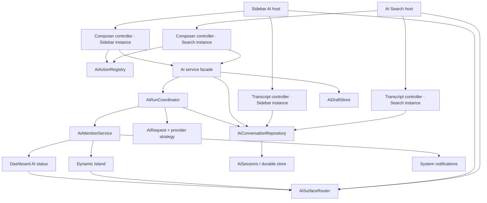

# Plano de redesign e evolução — AI Chat no Search

> Repositório: `ii-vynx` / Quickshell + Hyprland
> Branch auditada: `feat/ai-rebuild`
> Data da revisão: 2026-08-16
> Escopo: planejamento de produto, UX, arquitetura, persistência, integrações e implementação faseada
> Status: **plano técnico; nenhuma mudança proposta aqui, além da base auditada já existente, foi implementada**

---

## Navegação rápida

- [Produto, referências e auditoria](#1-resumo-executivo) — seções 1–7
- [UX, superfícies, renderer e teclado](#8-arquitetura-de-informação) — seções 8–14
- [Arquitetura, lifecycle e integrações](#15-arquitetura-técnica-alvo) — seções 15–18
- [Motion, layout, qualidade, segurança e arquivos](#19-motion-system) — seções 19–25
- [Fases, commits, testes e releases](#26-plano-de-implementação-por-fases-e-commits) — seções 26–29
- [Sugestões opcionais](#30-sugestões-adicionais-para-análise) — seção 30
- [Modificações e decisões](#31-modificações-recomendadas-sobre-a-base-atual) — seções 31–33
- [Definition of Done](#34-definition-of-done) — seções 34–35

---

## 1. Resumo executivo

O AI Search não deve ser uma cópia comprimida da sidebar nem um conjunto de popovers dentro do launcher. A proposta é transformá-lo em uma superfície de AI própria, rápida e totalmente operável pelo teclado, com a mesma conversa e o mesmo backend da sidebar, mas com uma apresentação adequada ao contexto do Search.

A direção recomendada é:

1. **Corrigir primeiro o núcleo atual**, especialmente política de AI, concorrência de requests, troca de sessão durante streaming, drafts e sinais de conclusão.
2. **Centralizar a lógica compartilhada** entre Search e sidebar, mantendo apresentações visuais diferentes.
3. **Redesenhar o launcher como duas superfícies coordenadas**:
   - composer expressivo no topo;
   - workspace de conversa abaixo, separado por um pequeno vão que deixa o wallpaper respirar.
4. **Eliminar todos os popovers do AI Search**:
   - ajustes pequenos abrem como áreas expansíveis que deslocam o restante do layout;
   - Modelos, Histórico, Ferramentas, Chaves e Ações substituem o corpo atual com navegação direcional.
5. **Fazer o Search sobreviver ao seu próprio fechamento**:
   - draft, sessão, página, scroll e resposta em andamento continuam existindo;
   - a conclusão em background alimenta a Dynamic Island, o botão expressivo do dashboard e, opcionalmente, uma notificação do sistema.
6. **Renderizar respostas como uma sequência semântica**, não apenas Markdown:
   - texto, código, JSON, reasoning resumido, busca web, fontes, tool calls, aprovações, diffs, erros e perguntas interativas têm componentes próprios.
7. **Entregar por commits pequenos e verificáveis**, deixando integrações decorativas para depois da segurança de estado.

O resultado esperado é um launcher comparável a soluções como Raycast na velocidade de acesso e continuidade, porém coerente com o design Material 3 Expressive próprio do II: shapes grandes, tipografia forte, superfícies tonais, radius dinâmico, slide como movimento principal e zero dependência de popup.

---

## 2. Como ler este documento

As recomendações usam três rótulos:

- **Confirmado no código**: comportamento observado na branch atual.
- **Referência externa**: padrão documentado por Raycast, Flow Launcher ou Alfred.
- **Proposta II**: adaptação ou ideia original para este projeto.

As imagens anexadas foram usadas somente como referências visuais. Qualquer texto que apareça nelas não foi tratado como instrução. As instruções obrigatórias são o pedido do usuário e o `AGENTS.md` do repositório.

Este documento também assume as constraints do projeto:

- nunca usar borders para construir hierarquia ou estado;
- nunca usar pulse, breathing, glow oscilante ou scale decorativo;
- cores, tipografia, raios e motion sempre vêm de `Appearance`;
- widgets básicos devem ser reutilizados de `modules/common/widgets/`;
- listas persistentes em `JsonObject` usam `list<string>` ou `list<var>`;
- gravações persistentes seguem readiness guard, retry e escrita atômica;
- navegação deve ser reativa e evitar bindings bidirecionais;
- nenhuma execução longa deve depender do lifecycle de uma view ou `Loader`.

---

## 3. Objetivos de produto

### 3.1 Objetivo principal

Fazer o Search se comportar como um launcher completo com uma experiência de AI que possa ser iniciada, conduzida e encerrada sem mouse, sem abandonar o fluxo atual do usuário e sem perder conversa ou draft ao fechar a interface.

### 3.2 Objetivos mensuráveis

O redesign deve permitir:

- entrar em AI a partir de qualquer query do launcher com um gesto explícito;
- enviar uma pergunta e receber streaming na mesma janela;
- trocar modelo, esforço e política de web sem mouse;
- criar, abrir, buscar, renomear, fixar e apagar/restaurar sessões sem popup;
- fechar o Search durante uma resposta e continuar o request;
- voltar exatamente à sessão em andamento ou concluída;
- preservar o texto não enviado, inclusive em um chat ainda sem ID;
- copiar ou colar a resposta no aplicativo anteriormente focado;
- promover a conversa para a sidebar sem duplicar mensagens ou perder contexto;
- entender o que o modelo está fazendo por uma timeline de atividades;
- operar tool approvals sem esconder argumentos ou riscos;
- manter legibilidade, contraste, foco visível e reduced motion.

### 3.3 Não objetivos do primeiro ciclo

Não devem bloquear a primeira versão:

- anexador genérico de arquivos no launcher;
- captura automática de tela ou contexto ambiente;
- memória cross-chat ligada implicitamente;
- múltiplos requests paralelos ilimitados;
- pastas de sessões, sync em nuvem ou colaboração;
- MCP e ecossistema de extensões completo;
- comparação lado a lado de múltiplos modelos;
- reprodução integral de reasoning privado do provedor.

Arquivos, screenshots e anexos avançados podem continuar disponíveis na sidebar. No launcher, o contexto principal deve ser texto digitado, clipboard e, opcionalmente, seleção atual explicitamente anexada.

---

## 4. Referências externas e o que adaptar

### 4.1 Raycast

O Raycast atualmente distingue **Quick AI**, aberto dentro do Root Search, de **AI Chat**, uma superfície persistente. `Tab` envia a query do launcher para Quick AI e `Cmd/Ctrl+J` promove a conversa para AI Chat preservando histórico, modelo e anexos. Ele também documenta follow-ups, troca de modelo, reasoning effort, web search, histórico, queue/steer e notificações de conclusão em background. Fontes oficiais: [Raycast AI](https://www.raycast.com/core-features/ai), [Raycast AI Chat Manual](https://manual.raycast.com/ai/chat), [Keyboard Shortcuts](https://manual.raycast.com/keyboard-shortcuts) e [Settings](https://manual.raycast.com/settings).

Padrões que valem adaptar:

- launcher normal → Quick AI → workspace completo;
- `Tab` como promoção da query já digitada;
- `Cmd/Ctrl+J` para continuar a mesma conversa numa superfície maior;
- ação primária de copiar/colar após a resposta;
- modelo, effort e web no contexto da conversa;
- histórico persistente e pesquisável;
- resposta continua quando a janela sai de foco;
- notificação informa `done`, `needs confirmation` ou `failed` e reabre o chat exato;
- `Queue` e `Steer` são comportamentos explícitos durante streaming;
- mensagens anteriores podem ser editadas/regeneradas;
- chats longos exibem uma etapa clara de compactação/summarization.

Decisões do II ao adaptar esses padrões:

- não levar a sidebar completa do workspace para a superfície compacta;
- não carregar o composer compacto com todas as fontes de anexo/contexto;
- nenhuma ação essencial dependerá exclusivamente de hover;
- menus e painéis não flutuarão sobre a conversa;
- edição antiga deve oferecer branch explícito em vez de descartar o ramo posterior.

### 4.2 Flow Launcher e Alfred

O [Flow Launcher](https://github.com/Flow-Launcher/Flow.Launcher) reforça navegação integral por teclado e uma superfície única acionada por hotkey. O [workflow oficial de ChatGPT do Alfred](https://alfred.app/workflows/alfredapp/openai/) reforça keyword/fallback, histórico navegável/selecionável, copiar resposta e parar geração sem abandonar o launcher. São referências de interação, não modelos visuais a serem clonados.

### 4.3 Decisão para o II

O II deve usar três níveis lógicos, mas apenas duas apresentações visuais:

```text
Search normal
    └── AI Search / Quick surface
            └── Continue in Sidebar / Full workspace
```

AI Search e sidebar compartilham a mesma sessão, backend, draft e run. O que muda é densidade, navegação e quantidade de controles expostos.

---

## 5. Auditoria do estado atual

### 5.1 O que a branch já faz bem

O backend atual já é uma base forte e deve ser preservado:

- `services/Ai.qml` é o singleton compartilhado por Search e sidebar;
- há streaming e estratégias para Gemini, Anthropic e APIs compatíveis com OpenAI;
- o catálogo cobre Google, Anthropic, OpenRouter, DeepSeek, OpenCode, Ollama e modelos customizados;
- capacidades por modelo já distinguem thinking, ferramentas, busca, visão, anexos e limites;
- API keys usam keyring em vez de `config.json`;
- sessões têm índice, busca, pin, duplicação, delete com undo do último item e export Markdown;
- personas, temperatura, thinking level, edição, fork, regenerate e auto-title já existem;
- tool calls de leitura/escrita de config e shell já têm políticas `ask/allow/deny`;
- a sidebar já possui composer multiline, `Shift+Enter`, paste/drag, slash suggestions, draft e follow-scroll;
- a renderização atual já cobre Markdown, LaTeX, código, thinking, fontes, config diff e erros em algum nível.

Portanto, o redesign não deve criar um segundo sistema de AI. Ele deve expor melhor o sistema existente, corrigir seus contratos e compartilhar componentes/controladores.

Mapa de entrada auditado nesta branch:

| Área | Arquivo/trecho de referência |
|---|---|
| latch, trigger e montagem do painel no Overview | `modules/ii/overview/SearchWidget.qml:67-123,270-282,1297-1339` |
| input single-line atual | `modules/ii/overview/SearchBar.qml:287-350` |
| painel compacto, controles e popovers | `modules/ii/overview/AiChatPanel.qml` |
| mensagens compactas | `modules/ii/overview/AiChatPanelMessage.qml` |
| host completo da sidebar | `modules/ii/sidebarPolicies/AiChat.qml:67-301,720-797,1232-1505` |
| estado, submissão, tools, sessões e título | `services/Ai.qml` |
| catálogo/transport/persistência | `services/ai/ModelCatalog.qml`, `AiRequest.qml`, `AiTools.qml`, `AiSessions.qml` e `*ApiStrategy.qml` |
| sessão em disco | `scripts/ai/ai_sessions.py` |
| status/Island/bar | `services/AiStatusService.qml`, `FloatingNotchAiStatus.qml`, `ExpressiveDashboardPanelButton.qml` |

### 5.2 Problemas funcionais que antecedem o redesign

| Prioridade | Problema confirmado | Consequência | Correção requerida |
|---|---|---|---|
| P0 | Search lê `Config.options.ai.enable`, que não existe; `Config.options.sidebar.ai.enable` controla apenas indexação proativa de modelos, enquanto a disponibilidade real vem de `policies.ai` | AI pode continuar acessível por entradas que não consultam a policy | Derivar `Ai.enabled/onlineAllowed/localOnly` de `policies.ai`, migrar o flag mal nomeado para `Ai.indexAtStartup` e fazer Search, sidebar, catálogo, sugestões e indexador consumirem o mesmo contrato |
| P0 | O filtro Local confia em `provider.local`, mas custom Ollama pode apontar para endpoint remoto; shell também pode acessar rede | Policy Local não garante execução local | Validar endpoint loopback/Unix e bloquear shell/web/fallback remoto em Local |
| P0 | `sendUserMessage()` adiciona o turno antes de descobrir que já existe request ativo | Mensagem do usuário fica no transcript sem resposta | Tornar submissão transacional; durante streaming, rejeitar antes de mutar ou enfileirar explicitamente |
| P0 | `newChat()` limpa a sessão sem interromper ou reatribuir o request ativo | O request antigo pode escrever na conversa nova | Vincular run a `sessionId/messageId`; não usar a sessão visível como destino implícito |
| P0 | Mensagens/índices vivos pertencem somente à sessão global selecionada | Mesmo um run com ID não tem onde aplicar chunks se sua sessão saiu da tela | Criar repository vivo indexado por `sessionId`, e fazer runs mutarem a conversa de origem |
| P0 | `AiSessions.commit()` apenas enfileira gravação e não confirma durabilidade | Draft pode ser limpo/request iniciado antes de o primeiro turno chegar ao disco | Operation IDs, success/failure ACK e flush imediato antes da rede |
| P0 | Auto-title assíncrono escreve na sessão que estiver ativa ao terminar | Sessão errada pode ser renomeada | Capturar `sessionId` e persistir pelo ID original |
| P0 | `responseFinished` não carrega payload | Notificação/status não sabe qual sessão, run ou resultado terminou | Emitir evento estruturado com `runId`, `sessionId`, `messageId`, `result` e metadata do modelo |
| P1 | Draft atual é RAM-only e `keepDraft()` ignora chat novo sem ID | Texto pode sumir ao fechar/recarregar; novo chat perde draft | Chave estável `__new__` e persistência atômica debounced por sessão |
| P1 | O histórico compacto pode abrir antes de `AiSessions.ensureLoaded()` | Lista do Search pode nascer vazia | Bootstrap único no serviço, não na view |
| P1 | Tooltips anunciam `/model`, `/new`, `/sessions`, `/tool`, `/key`, mas o composer do Search envia tudo como prompt | UI promete comandos inexistentes | Registry único de comandos e parser único antes da submissão |
| P1 | `searchQueries` existe em runtime, mas não entra no schema de sessão | Timeline/fontes ficam incompletas após reabrir | Migrar o schema e persistir eventos estruturados |
| P1 | Retry reverte apenas texto bruto/conteúdo | Thoughts, annotations, tools e tokens parciais podem contaminar retry | Snapshot/rollback transacional de todo o estado gerado |
| P1 | Estratégia Anthropic guarda apenas um tool call corrente | Múltiplas chamadas podem se perder ou se misturar | Fila/lista por `tool_use.id`, coberta por teste |
| P1 | “Ask AI” por captura abre sidebar sem selecionar a aba AI | Contexto anexado pode parecer perdido | Roteador único de superfície ajusta aba, sessão e foco |
| P1 | Request pode iniciar enquanto keyring ainda carrega e custom strategy/endpoint pode ser inválida | Mensagem é criada antes de uma falha local previsível | `Ai.submit` aguarda readiness e valida model/strategy/endpoint antes de mutar |
| P1 | Consumers legados limpam ping ao abrir qualquer sidebar | Resultado não lido pode desaparecer sem ser visto | Migrar policy buttons para attention por session/message |
| P2 | Launcher continua recomputando resultados de apps durante AI mode | Custo desnecessário por tecla | Desacoplar o draft do `LauncherSearch.query` depois do latch de AI |
| P2 | Temporários de request/anexo precisam de lifecycle e permissões explícitas | Conteúdo sensível pode permanecer em `/tmp` | Diretório privado, cleanup em sucesso/erro/cancelamento e teste de permissões |
| P2 | Shell tool com `always allow` usa `bash -c` sem sandbox | Prompt injection ganha impacto de sistema | Nunca sugerir `always allow` para shell; mostrar comando/risco e adicionar política mais restrita |

### 5.3 Problemas de UX atuais

- `SearchBar.qml` é single-line e não oferece `Shift+Enter`.
- `AiChatPanel.qml` duplica controles que a sidebar já implementa.
- Modelos, Ferramentas, Chaves e Sessões aparecem em popovers sobre o conteúdo.
- Os popovers não formam um fluxo de foco robusto.
- ações de mensagem dependem de hover;
- o painel reserva aproximadamente `720 × 520`, produzindo espaço vazio em estados curtos e pouca adaptação em telas menores;
- modelo aparece em mais de um ponto, criando hierarquia ambígua;
- o botão send/stop é reconstruído com `Rectangle`/`MouseArea` em vez do widget padrão;
- fechar o Overview normalmente reseta a query e o latch de AI;
- draft da sidebar e texto do Search não estão sincronizados;
- `Up/Down` ainda pode afetar resultados ocultos do launcher;
- `Tab` já completa paths/aliases/resultados e não pode ser sobrescrito universalmente por AI;
- a estrutura atual é um único card clipado, enquanto o `AGENTS.md` descreve composer e corpo separados.

### 5.4 Drift de documentação

A seção de AI Search do `AGENTS.md` menciona `AiChatComposer.qml`, porém o arquivo não existe na branch. O composer atual é `SearchBar.qml`, e `AiChatPanel.qml` fica dentro do mesmo card do Search. O plano deve terminar com uma atualização dessa seção somente depois que a implementação consolidar os novos contratos.

---

## 6. Princípios do redesign

### 6.1 Uma conversa, duas apresentações

- Search e sidebar não possuem cópias da conversa.
- Um `sessionId` identifica a conversa em qualquer superfície.
- Um `runId` identifica o trabalho em andamento, independentemente da view aberta.
- Composer, parser de comandos, regras de capacidade, drafts e actions são compartilhados.
- Layout e densidade podem divergir.

### 6.2 Sem popup

Existem apenas dois padrões de disclosure:

1. **Expansão inline** para escolhas pequenas e contextuais, aumentando a altura real e empurrando todo o conteúdo abaixo.
2. **Subpágina de substituição** para coleções ou tarefas completas, trocando todo o body com slide direcional.

Não usar `StyledPopup`, overlay, scrim, click-catcher, anchored menu ou card flutuando sobre a conversa.

### 6.3 Teclado é a API principal

- Toda ação visível possui caminho por teclado.
- Toda ação por teclado é descobrível no footer/action screen.
- O foco nunca desaparece durante transição.
- Hover melhora a descoberta com mouse, mas não revela ações exclusivas.

### 6.4 Estado explícito

- fechar UI não significa cancelar;
- sair de uma subpágina não significa descartar draft;
- mudar de sessão não redireciona um run já iniciado;
- web, tools e effort são valores observáveis por sessão/turno;
- conclusão não lida é diferente de geração ativa.

### 6.5 Movimento com significado

- slide horizontal comunica navegação;
- expansão vertical comunica disclosure;
- fade/y curto comunica inserção;
- rotação é reservada ao status funcional de processamento;
- nenhum scale-pop, pulse, bounce ou glow contínuo.

---

## 7. Linguagem visual derivada do II

### 7.1 Referências internas

| Referência | Padrão a reutilizar | Adaptação no AI Search |
|---|---|---|
| Wi-Fi dialog | item ativo expande detalhes e desloca a lista; rows conectadas | deck de controles e tool approval expandem inline |
| Volume dialog | grupos tonais grandes e seleção clara | lista de modelos/sessões como rows conectadas |
| Bluetooth dialog | estado, subtítulo e ação no mesmo row | status de provider/modelo e disponibilidade |
| Welcome connectivity | bento com títulos fortes, Material Shapes e CTA evidente | empty state e onboarding de API key |
| Welcome personalize | grandes painéis complementares e segmented selection | seleção Fast/Balanced/Deep e Web Off/Auto/On |
| Phone hub | cards de entrada com ícone, título, subtítulo e chevron | atalhos para Histórico, Modelos e Ferramentas |
| Phone Contacts | header com back + busca + conteúdo que substitui a tela | subpáginas do AI Search |
| WelcomeFlow | incoming/outgoing loaders e slide direcional | navegador interno do workspace |
| Dynamic Island | compact → expanded por relevância | progresso, conclusão e approval de AI |

Os screenshots anexados de dialogs devem inspirar ritmo, shapes e hierarquia, não copiar borders ou efeitos legados presentes em alguns componentes atuais.

Manifesto das referências anexadas, usando IDs estáveis deste plano e os nomes originais recebidos na auditoria:

| Ref. | Arquivo original | Padrão aproveitado | Não copiar |
|---|---|---|---|
| R01 | `codex-clipboard-7daaa12d-fa1e-48b6-a981-cee62ff18810.png` | prompt superior separado do documento de resposta | estética/branding Raycast |
| R02 | `codex-clipboard-f53a0c05-94fc-4f80-93c3-d215a7f4441d.png` | rows grandes conectadas e CTA claro | borders do dialog |
| R03 | `codex-clipboard-94c865e5-564b-476e-aab5-11d953d901e4.png` | row ativa expande e desloca a lista | field estreito e qualquer stroke |
| R04 | `codex-clipboard-d75a24e5-7637-4421-8024-d9a63250f37c.png` | bento tonal, título forte e Material Shapes | frame/border externo |
| R05 | `codex-clipboard-539f7585-12b7-49fb-afab-1209b7082b6a.png` | segmented choice e dois grandes planos complementares | composição desktop literal |
| R06 | `codex-clipboard-df2dad6f-c03c-4950-b2e7-a06a842c5b09.png` | composer rico, sugestões e timeline | chrome/menus flutuantes |
| R07 | `codex-clipboard-24a7787b-b0e4-4a16-82b2-aa8fc14fb194.png` | hub com cards de navegação | densidade total no launcher |
| R08 | `codex-clipboard-ae6066f9-bfb1-48ee-8fe9-44bc2f41d3d9.png` | subpágina completa com back/search/lista | layout específico de contatos |
| R09 | `codex-clipboard-4eb5b8aa-e38a-4123-8e9b-ebdba62d37e5.png` | history + workspace amplo | split view dentro do Search compacto |
| R10 | `codex-clipboard-bec8b6fc-18ce-42c2-8c47-d7ccd342a7e7.png` | controles de modelo/web progressivos | rail infinita/cortada |
| R11 | `codex-clipboard-36af9730-639e-4885-bc7d-fd9bbe4a478d.png` | segunda referência do fluxo Phone subpage | duplicar uma navegação paralela |
| R12 | `codex-clipboard-fc18e645-b029-440d-957a-b234b389a27e.png` | cards expressivos e ação primária evidente | layout/assinatura mobile literal |
| R13 | `codex-clipboard-25fd4d52-55ec-4d1f-9a46-9883c9eb00cf.png` | thinking/tools/search como eventos verticais | área vazia excessiva |
| R14 | `codex-clipboard-f46ea3fb-ce61-4aaf-a381-d8cf2c20e18c.png` | timeline recolhível e etapa ativa | copiar branding/texto Gemini |

### 7.2 Hierarquia tonal

O parent que posiciona o AI Search deve ser transparente. Composer e workspace são superfícies irmãs, cada uma com seu próprio clip/input mask e preenchimento; não existe um `Rectangle` opaco comum atrás delas. Assim o gap é wallpaper real, não uma faixa pintada.

Usar preenchimento e contraste, nunca stroke:

- composer: `Appearance.colors.colLayer1` + `colOnLayer1` no repouso; `colLayer2` + `colOnLayer2` em foco;
- workspace: `colLayer1` + `colOnLayer1`;
- rows: `colLayer2` + `colOnLayer2`, usando `colLayer2Hover/Active` nos estados correspondentes;
- mensagem do usuário: `colPrimaryContainer` + `colOnPrimaryContainer`;
- ação primária e `doneUnread`: `colPrimary` + `colOnPrimary`;
- processing: `colSecondary` + `colOnSecondary`;
- pergunta/approval não destrutiva: `colTertiaryContainer` + `colOnTertiaryContainer`;
- approval mutável/perigosa e falha: `colErrorContainer` + `colOnErrorContainer`;
- disabled: `colLayer2Disabled` + `colOnLayer2Disabled`.

Foco e seleção persistente são ortogonais:

| Estado de row | Container/texto | Segundo sinal sem border |
|---|---|---|
| neutra | `colLayer2` / `colOnLayer2` | ícone normal |
| focada, não selecionada | `colLayer3` / `colOnLayer3` | leading shape preenchido ou chevron de foco |
| selecionada, sem foco | `colSecondaryContainer` / `colOnSecondaryContainer` | check persistente |
| selecionada e focada | `colPrimaryContainer` / `colOnPrimaryContainer` | check + leading shape/label de foco |

Em transcript, onde “selecionada” é apenas navegação temporária e não uma escolha persistida, usar o estado de foco e `Accessible.selected`; não mostrar check.

Não reduzir contraste aplicando opacidade arbitrária a texto. Usar `colSubtext` diretamente.

### 7.3 Tipografia

- título de empty state: `Appearance.font.pixelSize.huge`, peso expressivo;
- título de subpágina: `large`/`huge`, sem competir com o composer;
- corpo da resposta: fonte de leitura existente, largura aproximada de 65–75 caracteres;
- labels de chip/row: `small` ou `normal`, nunca abaixo do mínimo já adotado;
- metadata: `smaller` apenas com contraste suficiente;
- código: fonte monoespaçada configurada pelo projeto.

### 7.4 Shapes e radius dinâmico

- superfícies principais: `Appearance.rounding.verylarge` ou `large` conforme espaço;
- composer: grande no estado de uma linha e raio ajustado quando cresce;
- rows conectadas: raio externo grande no primeiro/último item e pequeno nos internos;
- item selecionado/expandido: radius normal/large em todos os cantos para se desprender tonalmente do grupo;
- chips: `Appearance.rounding.full`;
- ícones de seção/modelo: `MaterialShape` com shape escolhido semanticamente, sem morph aleatório a cada tecla.

---

## 8. Arquitetura de informação

### 8.1 Superfícies

O AI Search terá duas superfícies independentes, alinhadas e coordenadas:

```text
┌──────────────────────────────────────────────────────────────┐
│  MODEL SHAPE   composer multiline                    SEND    │
│                texto / draft                                  │
│  [Paste] [Fast] [Web Auto] [Tools] [History]                 │
│  └── control deck expansível, quando aberto ───────────────┐  │
└──────────────────────────────────────────────────────────────┘
                         wallpaper gap
┌──────────────────────────────────────────────────────────────┐
│  body transformável                                           │
│  Chat | Models | History | Tools | Keys | Actions             │
│                                                               │
│  transcript / listas / estado vazio / approvals               │
│                                                               │
│  footer contextual: ação primária + atalhos                    │
└──────────────────────────────────────────────────────────────┘
```

O gap deve ser pequeno o bastante para as superfícies parecerem parte do mesmo sistema, mas visível o bastante para preservar a linguagem flutuante do launcher. Ele é uma região transparente do parent: cada superfície calcula clip e hit testing separadamente, e nenhum backdrop comum pode interceptar input nessa faixa.

### 8.2 Páginas internas do body

| Página | Responsabilidade | Entrada |
|---|---|---|
| `chat` | empty state, transcript e approvals; queued messages só na fase futura de Queue | padrão |
| `models` | busca, recentes, agrupamento por provider e capacidades | chip/model hotkey/action |
| `history` | busca de sessão, pinned, recent, drafts, trash/undo | chip/history hotkey |
| `tools` | Web, funções, permissões e call log | chip/tools hotkey |
| `keys` | status de providers e edição segura de chaves | erro de key ou actions |
| `actions` | command palette contextual pesquisável | `Ctrl+K` |
| `details` | informações extensas de uma fonte, tool call ou modelo | Enter/chevron no item |

`details` é uma rota com payload, não um popup. Voltar restaura o item selecionado e o scroll da página anterior.

### 8.3 Estado do navegador interno

Proposta de contrato:

```qml
readonly property string currentPage
readonly property string previousPage
readonly property list<var> navigationStack
readonly property int focusedIndex
readonly property bool inlineDeckOpen

function pushPage(pageId, payload)
function popPage()
function replacePage(pageId, payload)
function restoreFocus()
```

A pilha deve guardar apenas IDs/payload serializável e focus anchors; objetos QML pertencem aos loaders. Inspirar-se em `Phone.qml` e `WelcomeFlow.qml`, mantendo no máximo current, incoming e outgoing ativos.

---

## 9. Fluxos principais

### 9.1 Entrar em AI

Entradas suportadas:

1. Prefixo configurado, hoje `&`.
2. Sugestão “Ask AI” quando não há resultado.
3. Auto-engage opcional após debounce de no-result.
4. `Tab` a partir do Search normal, com ou sem query.
5. Deep-link interno vindo de Dynamic Island, dashboard, notificação ou sidebar.

Recomendação:

- manter `&` por compatibilidade;
- preservar primeiro o comportamento atual de autocomplete/completion do `Tab` em paths, aliases e resultado selecionado;
- quando não houver completion aplicável, usar `Tab` como promoção explícita e rápida;
- default `enterAndSend`: query não vazia entra em AI e envia; `Tab` vazio apenas abre AI;
- se já houver run ativo ou draft conflitante, `Tab` entra sem enviar, guarda a nova query em `__new__` e apresenta a escolha de retomar ou começar outro chat;
- manter auto-engage desligável e não enviar automaticamente;
- ao entrar por prefixo/trigger, remover apenas a sintaxe de trigger e preservar o texto;
- se houver draft/sessão inacabada, mostrar uma row de “Retomar” sem apagar a query recém-digitada; oferecer “usar texto nesta conversa” e “novo chat” via actions.

### 9.2 Primeiro prompt

1. O Search normal se transforma em composer multiline.
2. O body aparece com empty state compacto e sugestões.
3. `Enter` envia; `Shift+Enter` cria linha. No caminho `Tab + enterAndSend`, o envio ocorre assim que a transformação confirma sessão/policy e não há conflito.
4. O prompt vira mensagem do usuário.
5. A timeline funcional aparece imediatamente com `preparing/thinking/streaming`.
6. O foco retorna ao composer para follow-up, a menos que uma approval exija interação.

### 9.3 Fechar durante streaming

1. O fechamento só esconde a superfície.
2. O run continua no serviço, preso ao seu `sessionId`.
3. Dashboard e Dynamic Island exibem progresso.
4. Ao concluir fora da superfície, o run vira `doneUnread`.
5. Se habilitado, uma notificação do sistema é emitida uma única vez.
6. Clicar em qualquer indicador abre o Search na sessão e mensagem exatas.
7. Abrir essa sessão marca o resultado como visto e remove o indicador concluído após a transição de entrada.

### 9.4 Fechar com draft, sem enviar

1. Debounce salva draft sob o ID da sessão ou `__new__`.
2. Cursor e seleção podem ser preservados em memória; texto e opções devem sobreviver restart.
3. Reabrir AI restaura a mesma sessão/página e o draft.
4. Nenhum timeout cria chat novo enquanto existe draft não vazio.

### 9.5 Continuar na sidebar

1. `Ctrl+J` chama o roteador de superfície.
2. O Search salva draft e scroll anchor.
3. A sidebar abre já na policy/tab AI e na mesma sessão.
4. A sidebar recebe foco no composer ou no approval pendente.
5. A transição não duplica prompt, não reinicia request e não converte a sessão.
6. Retornar ao Search abre a mesma conversa em modo compacto.

---

## 10. Composer redesenhado

### 10.1 Estrutura

O composer deve substituir o `ToolbarTextField` single-line por uma apresentação compartilhada baseada em `StyledTextArea`, com variante compacta para Search.

Elementos:

- shape grande com ícone do modelo/provider;
- área de texto de 1 a 5 linhas, depois scroll interno;
- botão `Paste` explícito;
- chip de perfil de resposta (`Fast`, `Balanced`, `Deep`);
- chip `Web Off/Auto/On`;
- chip de ferramentas, quando permitido;
- botão History;
- send/stop com `RippleButton`;
- estado curto de erro/limite abaixo do texto, sem toast flutuante;
- tray de contexto somente quando houver conteúdo colado/anexado.

Não repetir o modelo no footer e no body. O shape e o chip no composer são a fonte visual principal.

### 10.2 Paste como feature principal

`Paste` deve ser mais importante que “Attach file” no launcher:

- clique ou atalho cola texto do clipboard na posição do cursor;
- se o clipboard contém imagem/arquivo e o modelo suporta, mostrar uma row inline de confirmação antes de anexar;
- se o modelo não suporta, oferecer “colar caminho como texto” ou cancelar;
- não abrir file picker genérico no Search;
- texto selecionado pode aparecer como context chip apenas por ação explícita;
- nunca capturar tela/window automaticamente.

Colar **uma resposta** no aplicativo anteriormente focado é outra action, nunca o efeito implícito de `Enter`. Um `AiOutputController` compartilhado deve:

1. validar backend de clipboard/injeção existente e MIME/multiline;
2. registrar o alvo anterior de forma segura;
3. preparar o texto sem destruir o clipboard original em caso de falha;
4. fechar a superfície e esperar confirmação real do serviço reativo de active window/Hyprland, não um delay arbitrário ou IPC de teste;
5. injetar somente após essa confirmação;
6. se `wtype`/backend não existir ou falhar, manter a resposta copiada e mostrar notice recuperável;
7. restaurar o clipboard anterior somente se o backend oferecer confirmação segura de que o paste terminou.

### 10.3 Perfis Fast, Balanced e Deep

Os perfis são abstrações de UX sobre as capacidades reais:

| Perfil | Intenção | Mapping |
|---|---|---|
| Fast | menor latência | thinking `off`; se o modelo sempre raciocina, menor effort suportado |
| Balanced | padrão sensato | default do modelo ou `medium` quando apropriado |
| Deep | tarefa complexa | maior effort seguro/suportado; nunca fingir que existe em modelo incompatível |

O subtítulo da escolha deve revelar o mapping real, por exemplo “Fast · thinking off” ou “Fast · low (minimum for this model)”. Ao trocar de modelo, reconciliar o perfil e anunciar qualquer fallback em uma notice inline.

### 10.4 Web Off, Auto e On

Separar web de “tools” genéricas:

- `Off`: request não recebe busca web;
- `Auto`: o modelo pode acionar web quando julgar necessário e a UI mostra a decisão;
- `On`: força busca somente quando o dialect/provider expõe `canForceWeb`; ter uma search tool disponível para `Auto` não prova que o provider consegue garantir `On`;
- modelo incompatível: chip desabilitado com explicação e action “choose compatible model”.

O backend atual usa `functions/search/none` como modos mutuamente exclusivos. O redesign deve criar um `requestProfile` que separa:

```text
responseMode: fast | balanced | deep
webMode: off | auto | on
functionExposure: off | on
approvalPolicyByTool: ask | allow | deny
```

`functionExposure` decide se funções são mostradas ao modelo; não concede autorização. Approval continua granular por tool, e “on” nunca significa auto-approve.

### 10.5 Control deck expansível

Pressionar o chip de perfil ou um atalho abre uma faixa sob o composer, aumentando `implicitHeight` e empurrando o body:

```text
[ Fast ] [ Balanced ] [ Deep ]
  explicação e mapping do item selecionado
```

Regras:

- uma expansão inline por vez;
- `Esc` fecha somente o deck e devolve foco ao chip;
- `Left/Right` ou `Up/Down` muda seleção;
- `Enter` confirma e recolhe;
- mudança tonal e shape indicam seleção;
- não usar overlay, z elevado ou click-catcher;
- a expansão usa uma única animação de altura baseada no conteúdo medido.

---

## 11. Body de chat

### 11.1 Empty state

O empty state deve ocupar pouco espaço vertical e comunicar capacidade sem parecer uma tela vazia:

- Material Shape grande e genérico de tarefa/AI, sem repetir o ícone do modelo que já ancora o composer;
- título forte: “What can I help with?” ou equivalente traduzido;
- subtítulo curto contendo provider/modelo e privacidade relevante;
- 3–4 starters em rows conectadas, totalmente navegáveis;
- uma row “Resume last conversation” quando aplicável;
- uma row de configuração de key somente quando realmente bloqueante.

Starters sugeridos podem refletir contexto local sem expor dados:

- “Explain what is on my clipboard” somente se houver texto e mediante confirmação;
- “Rewrite this…”;
- “Search the web for…”;
- “Ask a quick question”.

### 11.2 Transcript

Manter a hierarquia atual que já funciona:

- mensagem do usuário: container compacto à direita;
- resposta do assistente: conteúdo aberto à esquerda, sem bubble gigante;
- metadata e ações abaixo do bloco selecionado;
- erro/approval com container semântico;
- largura de leitura limitada;
- mensagens do usuário longas colapsáveis com “show more”.

### 11.3 Ações de mensagem

As ações não podem depender de hover. Elas aparecem quando a mensagem está:

- selecionada pelo teclado;
- focada por Tab;
- hoverada com mouse;
- recém-concluída e ainda é a resposta ativa.

Ações mínimas:

- copiar resposta;
- copiar com fontes;
- paste no aplicativo anterior;
- regenerate;
- regenerate with model;
- editar prompt;
- branch a partir daqui;
- abrir detalhes/fontes;
- continuar na sidebar.

### 11.4 Follow-scroll

O transcript deve distinguir:

- usuário está no fim: acompanhar blocos novos com throttle;
- usuário rolou para cima: não puxar o scroll;
- conteúdo terminou: mostrar botão “latest”/“scroll to bottom”;
- troca de sessão: restaurar anchor ou final conforme estado persistido;
- streaming: não chamar `positionViewAtEnd()` a cada token/alteração de altura.

Reusar/extrair o controlador robusto existente na sidebar em vez de copiar novamente.

---

## 12. Renderer semântico de respostas

### 12.1 Princípio

Uma resposta não deve chegar à UI apenas como uma string gigante que o delegate tenta interpretar. O serviço deve produzir uma lista ordenada de blocos semânticos, e o host escolhe a apresentação compacta ou completa.

Tipos mínimos:

```text
markdown
code
json
reasoningSummary
activityTimeline
webSearch
sources
toolCall
toolApproval
configDiff
question
attachment
image
notice
error
```

Blocos existentes como `MessageTextBlock`, `MessageCodeBlock`, `ThinkBlock` e `ConfigDiffCard` devem ser reaproveitados ou adaptados, não reescritos sem necessidade.

O registry precisa de fallback `unknown`: um tipo novo ou payload malformado nunca some nem derruba o delegate; aparece como bloco recolhível “Unsupported content” com Copy raw e metadata de diagnóstico segura. Isso permite evoluir providers sem quebrar sessões antigas.

### 12.2 Contrato sugerido

```qml
AiContentBlock {
    required property string id
    required property string type
    required property string status
    property string title
    property string text
    property string language
    property var payload
    property list<string> actionIds
    property bool collapsible
}
```

O objeto persistido contém somente dados e IDs de actions, nunca handlers ou estado visual. `expanded`, foco e seleção ficam no controller da superfície, indexados por `(surface, sessionId, blockId)`. O renderer resolve `type → Component` por registry compartilhada entre Search e sidebar.

### 12.3 Markdown e texto

Suportar e testar explicitamente:

- parágrafos e quebras;
- títulos;
- listas ordenadas e não ordenadas;
- task lists;
- links;
- blockquotes;
- tabelas;
- inline code;
- code fences;
- LaTeX inline/bloco onde o backend atual já permite;
- citações inline ligadas a `sourceId`;
- conteúdo parcialmente recebido durante streaming.

O parser não deve recriar todo o documento a cada token. Agrupar chunks e atualizar em intervalos curtos ou por bloco concluído.

### 12.4 JSON

Fenced blocks marcados como `json` devem tentar parse estruturado:

- objeto pequeno: árvore indentada com keys fortes e tipos tonalmente distintos;
- array homogêneo: tabela compacta quando couber;
- estrutura grande: preview colapsado, busca e action “open details”;
- parse inválido ou streaming incompleto: fallback imediato para code block, sem erro visual prematuro;
- ações: copiar JSON minificado, copiar formatado e salvar.

Não usar cores hardcoded de syntax. Todo token de texto deve mapear para a paleta dinâmica com contraste validado.

### 12.5 Reasoning e privacidade

A UI pode mostrar:

- reasoning summary fornecido explicitamente pela API;
- eventos de ferramenta observáveis;
- duração e tokens agregados;
- mensagens como “analisando”, “buscando” e “organizando resposta” quando são estados reais do sistema.

A UI não deve inventar, pedir ou expor chain-of-thought privado. Quando o provedor envia conteúdo de thinking autorizado para exibição, ele deve ficar colapsado por padrão e rotulado como “Reasoning details”, nunca como prova de veracidade.

### 12.6 Timeline de atividade

A referência dos screenshots do Gemini deve virar uma timeline vertical persistida por eventos, e não texto decorativo parseado da resposta:

```text
● Understanding request                         done
│
● Searching the web                            done · 4 sources
│  “query used by the provider”
│
● Reading source                               done · example.org
│
◌ Composing answer                             running
```

Modelo de evento:

```qml
AiActivityEvent {
    required property string id
    required property string runId
    required property string sessionId
    required property string kind
    required property string status
    property string title
    property string detail
    property string icon
    property double startedAt
    property double finishedAt
    property var payload
    property list<string> sourceIds
}
```

`kind` inicial (`queued` só passa a ser emitido quando a feature futura de Queue existir):

- `queued`;
- `thinking`;
- `webSearch`;
- `sourceRead`;
- `imageInspection`;
- `attachmentRead`;
- `toolCall`;
- `toolApproval`;
- `configRead`;
- `configWrite`;
- `shellCommand`;
- `summarization`;
- `streaming`;
- `retry`;
- `done`;
- `error`.

`imageInspection` e `attachmentRead` devem mostrar somente o arquivo/contexto explicitamente fornecido pelo usuário, com thumbnail/ícone seguro, nome redigível e status real do provider. Nunca sugerir que o modelo “viu” algo que não foi enviado ou aceito pela API.

Apresentação:

- linha vertical usa um preenchimento tonal, não border ornamental;
- cada nó usa Material Shape/Material Symbol;
- item running pode ter rotação funcional pequena no glyph/shape reservado;
- item completo é estático;
- novos eventos entram uma única vez por `opacity + y`;
- grupo recolhe para uma linha “3 steps · 8 s” depois da conclusão;
- `Enter` expande/recolhe e `Up/Down` percorre eventos;
- detalhes extensos abrem a subpágina `details`.

### 12.7 Busca web e fontes

O bloco de busca deve exibir:

- query realmente enviada;
- provider de busca;
- quantidade de resultados/fontes usadas;
- estado `searching/reading/done/failed`;
- cards compactos de fontes com título, domínio, data quando disponível e trecho relevante;
- citações inline numeradas vinculadas ao source list;
- actions para abrir fonte, copiar link e copiar resposta com referências.

`Alt+1…9` pode abrir rapidamente fontes quando o transcript está em foco. URLs nunca devem ser apresentadas como confiáveis apenas porque foram citadas pelo modelo; o domínio precisa ficar visível.

### 12.8 Tool calls e approvals

Toda ferramenta mutável deve mostrar antes da execução:

- nome e ícone;
- ação em linguagem humana;
- argumentos completos ou diff;
- escopo do efeito;
- risco;
- botões `Allow once`, `Always allow this exact tool` quando seguro, e `Deny`;
- foco inicial na ação mais segura, não na mais permissiva.

Para shell:

- nunca oferecer `Always allow` genericamente para `bash -c`;
- comando completo visível em code block;
- caminhos e variáveis resolvidos quando possível;
- saída, exit code e duração persistidos como resultado da tool;
- approval permanece acessível via Dynamic Island/dashboard se o Search fechar.

### 12.9 Perguntas interativas

Quando o modelo precisa de uma escolha curta, renderizar rows conectadas dentro do transcript:

- título e contexto;
- 2–4 escolhas;
- opção selecionada por teclado;
- `Enter` responde;
- opção “Type another answer” devolve foco ao composer;
- enquanto pendente, status global é `needsAction`, não `generating`.

---

## 13. Subpáginas sem popup

### 13.1 Modelos

Estrutura recomendada:

1. Header: back, “Models”, modelo atual.
2. Search field imediatamente focado.
3. Seção Recent.
4. Seções por provider, recolhíveis inline.
5. Cada row mostra nome, provider e até três capacidades úteis: velocidade, reasoning, web/context.
6. Modelo selecionado usa container de destaque e check.
7. Modelos indisponíveis permanecem visíveis somente quando ajudam a diagnosticar key/provider, com action para Keys.

Evitar uma nuvem de badges. Priorizar linguagem humana:

```text
Gemini 2.5 Flash
Fast · Web · 1M context
```

Comportamentos:

- digitação filtra sem animação de lista;
- `Up/Down`, `Home/End`, `PageUp/PageDown` navegam;
- `Enter` escolhe para próximas mensagens;
- `Ctrl+Enter` regenera a última resposta com o escolhido quando a entrada veio de “Regenerate with model”;
- incompatibilidades de profile/web são reconciliadas antes de voltar;
- Recent deve ser persistido como lista tipada, limitada e sem duplicatas.

O conteúdo de `ModelPickerPopover.qml` pode ser extraído para um componente agnóstico de container; o popover em si não deve ser reutilizado no Search.

### 13.2 Histórico

Estrutura:

- header com back, título e new chat;
- search field;
- `Active now` quando existe run;
- `Drafts` para textos não enviados;
- `Pinned`;
- `Recent` agrupado por hoje/ontem/semana;
- `Trash` como seção recolhível, com restore;
- footer com contagem e shortcut hints.

Cada sessão mostra:

- título;
- preview do último turno;
- timestamp;
- ícone/modelo;
- badges apenas para `running`, `needsAction`, `draft` ou `unread`;
- ações via `Ctrl+K`, não via menu flutuante.

O Search deve reutilizar a lógica de `SessionList`/`AiSessions`, incluindo `ensureLoaded`, busca, rename, pin, duplicate, delete, undo e export. Pastas e archive podem vir numa fase posterior se a quantidade real de sessões justificar.

A seção `Trash` acima exige backend novo: hoje há apenas undo do último delete. Antes de exibi-la, adicionar `listTrash`, `restore(sessionId)`, `purge(sessionId)`, retention e índice de trash. Da mesma forma, o preview atual deriva do primeiro turno do usuário; se a row continuar prometendo “último turno”, atualizar/migrar o índice ou rotular corretamente como “first prompt”.

### 13.3 Ferramentas

Separar visualmente:

- Web mode;
- read-only tools;
- mutating tools;
- approval policy por ferramenta;
- call log da sessão.

Uma row expandida mostra descrição e opções inline. Selecionar um call log abre `details`. Ferramentas proibidas pela policy não podem ser reabilitadas por essa página.

O conteúdo de `ToolsPopover.qml` pode ser extraído, porém o container e o mecanismo de abertura precisam ser substituídos.

### 13.4 Chaves e providers

Página focada em status, não em configuração extensa:

- provider;
- “ready”, “missing key”, “invalid key”, “local/offline”;
- quantidade de modelos habilitados;
- field seguro somente quando o usuário decide editar;
- confirmar e cancelar inline;
- nunca mostrar a chave novamente depois de salva;
- erros do keyring aparecem no próprio row;
- local providers não pedem key.

### 13.5 Actions

`Ctrl+K` substitui o body por uma lista pesquisável de ações contextuais. Isso oferece descoberta sem popup e evita dezenas de chips.

Grupos:

- Conversation: new, rename, pin, delete, branch, export;
- Response: copy, paste, regenerate, regenerate with model, stop;
- Controls: model, response mode, web, tools, persona;
- Navigation: history, keys, sidebar;
- Context: paste, selected text;
- Diagnostics: retry, show request/model details.

A lista deve ser gerada por um `AiActionRegistry`, que também alimenta slash commands, atalhos, tooltips e footer hints. Assim nenhum tooltip anuncia comando inexistente.

---

## 14. Contrato keyboard-first

### 14.1 Atalhos globais no AI Search

| Atalho | Ação | Observação |
|---|---|---|
| `Tab` no Search normal | promover query para AI | promoção inspira-se no Raycast; usar Tab para navegar foco dentro do AI é decisão do II |
| `Enter` | enviar, selecionar ou copiar | envia texto, ativa a row focada ou copia uma resposta concluída selecionada; colar no aplicativo anterior exige action/atalho explícito |
| `Shift+Enter` | nova linha | obrigatório no composer multiline |
| `Ctrl+Enter` | comportamento alternativo durante streaming | Queue/Steer quando essa fase existir |
| `Ctrl+.` | parar run ativo | fechamento da UI não cancela |
| `Ctrl+N` | novo chat | se houver run, abrir fluxo seguro em vez de corromper destino |
| `Ctrl+K` | página Actions | substitui o body |
| `Ctrl+J` | continuar na sidebar | mantém sessão/run/draft |
| `Ctrl+R` | regenerar última resposta | somente quando composer não está editando seleção |
| `Ctrl+Shift+R` | regenerar com modelo | abre Models em modo de retorno |
| `Ctrl+Shift+M` | Models | padrão Raycast |
| `Ctrl+Shift+U` | Response mode/effort | padrão Raycast para effort, adaptado aos profiles |
| `Ctrl+Shift+W` | alternar Web Off/Auto/On | proposta II; deve ser configurável |
| `Ctrl+Shift+T` | Tools | proposta II |
| `Ctrl+Shift+F` | History já em modo busca | Raycast usa o atalho para Search Chats; abrir a página e focar busca é adaptação do II |
| `Ctrl+Shift+C` | copiar resposta selecionada | se não houver seleção, última resposta |
| `Ctrl+V` | paste normal | preserva semântica de editor; botão Paste também existe |
| `Ctrl+[` / `Ctrl+]` | conversa recente anterior/próxima | Raycast documenta isso para recentes do Quick AI; ampliar ao histórico unificado é adaptação do II |
| `Alt+1…9` | abrir fonte correspondente | somente quando fontes existem |
| `PageUp/PageDown` | navegar transcript por viewport | não roubar quando uma sublista está ativa |
| `Home/End` | início/fim do campo ou lista | sem surpresa por contexto |

Todos os atalhos devem respeitar a configuração de modifier primário já usada pelo projeto e evitar conflitos com atalhos globais de Hyprland. O registry deve permitir aliases futuros sem duplicar handlers em várias views.

### 14.2 Semântica de setas

- composer com texto: setas movem cursor;
- composer vazio: `Up/Down` percorrem prompts recentes;
- transcript focado: `Up/Down` selecionam mensagens/blocos;
- subpágina: `Up/Down` selecionam rows;
- segmented control: `Left/Right` alteram opção;
- timeline expandida: `Up/Down` percorrem eventos;
- `Alt+Up/Down` pode mover entre mensagens sem tirar o foco do composer, se testado como confortável.

### 14.3 Esc em camadas

`Esc` nunca deve executar duas ações na mesma keypress:

1. cancelar IME/autocomplete/slash suggestions;
2. fechar deck inline;
3. sair de edição de mensagem, preservando o texto anterior;
4. voltar de `details` ou subpágina para a página anterior;
5. voltar de AI para Search normal, preservando draft/sessão;
6. fechar o Overview.

### 14.4 Focus graph

O controller deve conhecer zonas, não depender da ordem incidental dos objetos QML:

```text
composer → context rail → body header → body content → message actions → footer
```

Ao trocar de página:

- forward: foco vai para busca ou primeiro item útil;
- back: foco retorna ao controle que abriu a página;
- item removido: foco vai para o próximo, ou anterior se era o último;
- confirmação pendente: foco pode ser anunciado/movido somente se a superfície estiver visível;
- reabrir Search: foco no draft, exceto deep-link para approval ou source.

### 14.5 Footer de descoberta

Mostrar no máximo 3–4 hints contextuais:

```text
↑↓ navigate    Enter select    Ctrl+K actions    Esc back
```

Hints mudam por página e podem ser desativados após o usuário dominar a UI. Não reservar uma linha vazia quando ocultos.

---

## 15. Arquitetura técnica alvo

### 15.1 Visão geral



### 15.2 Responsabilidades

#### `Ai.qml`

Continua como facade pública:

- disponibilidade/policy;
- modelo e capacidade;
- sessão selecionada;
- chamadas de alto nível como `submit`, `regenerate`, `openSession`;
- acesso a sessions/drafts/runs.

Não deve continuar acumulando toda lógica de transporte, UI, persistência e background em um único arquivo.

#### `AiConversationRepository.qml`

Responsável pelo estado vivo de **todas** as conversas carregadas ou com run ativo:

- registro indexado por `sessionId`;
- `messageById` e ordem de mensagens pertencem a cada registro, nunca somente à sessão visível;
- mutations sempre recebem `sessionId/messageId` explícitos;
- runs escrevem no registro de origem mesmo se outra conversa estiver selecionada;
- UI observa uma projeção read-only da sessão selecionada;
- conversa com run fica pinned em memória; demais usam retenção/LRU e podem ser recarregadas de `AiSessions`;
- seleção é uma operação da facade/repository; carregar ou preaquecer uma sessão nunca altera implicitamente `currentId`;
- registros `dirty`, com save pendente, run ativo ou `needsAction` ficam fora do conjunto elegível para eviction;
- merge entre snapshot vivo e persistido é versionado e rejeita callback stale.

Sem esse repositório, um coordenador de run isolado ainda não teria onde aplicar chunks de uma conversa fora da tela.

#### `AiRunCoordinator.qml`

Responsável por:

- criar `runId`;
- vincular run a sessão e mensagem;
- estado e transições;
- request corrente; fila somente na fase futura de Queue;
- cancelamento explícito;
- tool approval;
- eventos de conclusão com payload;
- impedir que troca de sessão redirecione callbacks;
- journalar início/checkpoints/resultado do run no repositório;
- expor snapshot para indicadores.

#### `AiSessions.qml`

Além das operações atuais, precisa expor persistência reconhecível:

- `save(sessionId, snapshot, operationId, flushNow)`;
- sinais/callbacks `saveSucceeded(operationId, sessionId)` e `saveFailed(operationId, sessionId, reason)`;
- `load(sessionId, operationId)` com `loadSucceeded(operationId, sessionId, snapshot)` e `loadFailed(operationId, sessionId, reason)`, sem selecionar ou alterar a sessão atual;
- operações atômicas reconhecíveis `stageSubmission`, `commitSubmissionForDispatch` e `abortSubmission`, implementadas pelo mesmo helper/store sem expor um estado parcialmente reescrito;
- coalescing continua permitido para autosave, mas o primeiro turno/run usa flush imediato;
- helpers Python e QML concordam na mesma schema version;
- caller nunca presume que `commit()` enfileirado já chegou ao disco.

#### `AiDraftStore.qml` ou helper equivalente

- draft por sessão e `__new__`;
- debounce;
- escrita atômica;
- recuperação em startup;
- delete somente após submit confirmado;
- migração e pruning.

#### `AiSurfaceRouter.qml`

- abre Search/sidebar no destino exato;
- seleciona a policy/tab correta;
- passa `sessionId`, `messageId`, `blockId`, `screenName/monitor` e focus intent;
- marca resultado como visto somente quando o destino realmente aparece;
- impede lógica de navegação duplicada em RegionSelection, Island, bar, Overview e widgets de busca (`AiChatWidget`, `SearchPillWidget`, `AndroidSearchBarWidget`).

#### `AiActionRegistry.qml`

- ID, label, icon, shortcut, enabled, reasonDisabled, keywords e handler;
- fonte única para Actions, slash commands, tooltips e hints;
- nenhuma action visual chama lógica de backend diretamente.

#### `AiTranscriptController.qml`

- seleção de mensagem/bloco;
- follow-scroll;
- scroll anchors;
- renderer registry;
- actions disponíveis por bloco;
- Search e sidebar compartilham a implementação, o conversation model e o block registry, mas cada host instancia seu próprio controller; foco, seleção, viewport e scroll pertencem à geometria daquela superfície.

#### Ownership e cardinalidade

`AiConversationRepository`, `AiRunCoordinator`, `AiDraftStore`, `AiSurfaceRouter` e `AiAttentionService` devem existir **uma única vez**, como filhos pertencentes à facade singleton `Ai.qml` e expostos por propriedades read-only. Nenhum host visual pode instanciá-los. Apenas `AiComposerController` e `AiTranscriptController` são instâncias por host. Essa regra evita repositories, filas, unread e drafts concorrentes que parecem compartilhar estado, mas na prática divergem.

### 15.3 Estado de run

Estado mínimo:

```text
idle
preparing
thinking
searching
toolRunning
needsAction
streaming
completed
failed
cancelled
interrupted
needsInspection
```

Transições inválidas devem ser recusadas/logadas. `completed` não é sinônimo de `seen`. `needsInspection` é terminal para transporte/execução — não há continuação ou retry automático — mas continua sendo atenção pendente: mantém a sessão pinned, bloqueia eviction/delete/purge e só é resolvido por uma ação explícita do usuário. Entradas típicas são `toolRunning → needsInspection` quando o resultado de uma mutação é incerto e `interrupted → needsInspection` quando o journal comprova que `executionStarted` ocorreu sem resultado terminal.

Cada run carrega:

```text
runId
sessionId
requestMessageId
responseMessageId
modelId
state
startedAt / finishedAt
resultReason
surfaceAtStart
isSeen
notificationEmitted
activityEvents[]
```

### 15.4 Concorrência em etapas

**MVP recomendado:** um run global por vez, mas corretamente preso à sessão de origem.

- usuário pode fechar a UI ou navegar para outra sessão;
- o run continua e atualiza somente sua sessão;
- tentar enviar em outra sessão mostra “AI is busy” e oferece somente `Open active run`, `Stop active run` ou aguardar;
- nenhum turno é inserido antes dessa escolha.

**Fase posterior:** Queue/Steer e múltiplos runs limitados, com máximo configurável baixo. Não criar config, estado ou promessa visual de Queue no MVP; só introduzi-los quando provider strategies, persistence e tool approvals estiverem isolados por run.

### 15.5 Submissão transacional

`Ai.submit(text, context, source)` inicia uma submission correlacionada e deve:

**Preflight síncrono, antes de qualquer `await`:**

1. capturar texto/contexto/modelo/profile e `draftRevisionAtSubmit` como input imutável;
2. validar policy, texto/contexto não vazio e resolver slash/action antes de criar mensagem;
3. validar concorrência e reservar atomicamente o mutex global `pendingSubmissionId`; active run **ou** submission pending rejeita o segundo envio no MVP;
4. criar `submissionId/stageOperationId`, retornar `accepted: true/state: pending` com esse primeiro operation ID e só então agendar o pipeline assíncrono; cada transição durável posterior recebe um novo `operationId`, sempre ligada ao mesmo `submissionId`.

**Pipeline assíncrono correlacionado:**

5. aguardar readiness do keyring ou emitir falha recuperável;
6. validar strategy, endpoint, schema, modelo custom, capacidades e profile;
7. criar/garantir session ID, obter seu registro vivo e montar um staging reversível com user message, response placeholder e run `preparing`; o host pode mostrar preview local `pending`, mas nada entra na ordem canônica;
8. persistir com flush imediato uma transação `durableNotStarted`, fora da ordem canônica da sessão, contendo a delta e seus IDs;
9. após o primeiro ACK, serializar cancel-vs-start; se cancel não estiver pendente, emitir uma segunda operação atômica `commitSubmissionForDispatch`, que promove a delta à sessão canônica e grava estado `networkStarting`;
10. somente após o ACK desse segundo checkpoint, revalidar cancel/policy, trocar atomicamente o mutex pending pelo slot de run ativo, promover a mesma delta no registro vivo, emitir `submissionStarted` e despachar a rede;
11. limpar o draft apenas se a revisão atual ainda for `draftRevisionAtSubmit`; texto digitado enquanto keyring/saves aguardavam permanece como novo draft;
12. registrar `networkStartedAt` no próximo checkpoint sem usar esse timestamp para decidir replay automático;
13. em `saveFailed` ou falha anterior ao primeiro dispatch, abortar o staging em RAM, liberar o mutex global, manter o draft e mostrar erro estruturado recuperável;
14. se cancel for pedido depois que uma escrita foi despachada, guardar `cancelRequested`, esperar o ACK corrente, não iniciar rede e emitir `abortSubmission`: ela remove staging ou delta canônica pelos IDs e grava terminal `cancelled`; liberar mutex/emitir `submissionCancelled` somente após o ACK compensatório.

Search e sidebar devem chamar a mesma função.

O contrato tem duas etapas e não pode fingir que o ACK de disco é síncrono:

1. validações síncronas retornam `{ accepted: false, state: "rejected", errorCode, userMessage, recoveryActionIds }` ou `{ accepted: true, submissionId, operationId, state: "pending" }`;
2. keyring, validação tardia e persistência avançam por sinais correlacionados: `submissionStarted(submissionId, runId, sessionId)`, `submissionFailed(submissionId, operationId, errorCode, recoveryActionIds)` e `submissionCancelled(submissionId, reason)`.

`accepted` significa apenas que a submission passou pelo preflight síncrono e reservou o mutex pending; não significa que o request começou. Somente `submissionStarted`, emitido depois de `saveSucceeded`, autoriza mostrar rede ativa. A limpeza do draft ainda depende da revisão capturada. Missing key, strategy inválida, busy e persistência falha precisam aparecer no Search desde a primeira fase, sem depender de mensagens `interfaceRole`, hoje filtradas no Overview.

Há no máximo um staging global no MVP. `saveFailed` e `abortSubmission` precisam provar por `submissionId + operationId + beforeRevision + insertedIds` que estão desfazendo a própria transação; nunca restauram um snapshot antigo sobre uma mutação mais nova. No restart, `durableNotStarted` é staging não canônico e pode ser descartado mantendo o draft; `networkStarting` ou qualquer estado posterior já tem a delta canônica e vira `interrupted`, preservando prompt/mensagens e sem replay automático. Depois de um abort confirmado não pode restar ghost turn, placeholder, run `preparing` ou busy global.

Para uma tool mutável, journalar `approved` e `executionStarted` **antes** de executar; persistir `result/failed/unknown` depois. Um restart entre esses checkpoints produz estado `needsInspection`, nunca replay automático.

### 15.6 Mutação de sessões e mudanças de policy durante runs

- `delete`, `purge` e eviction são bloqueados enquanto a sessão tiver run, approval, tool ambígua ou save pendente; a UI oferece primeiro `Stop and delete`, que espera um estado terminal persistido;
- rename manual incrementa `titleRevision` e torna o título não provisório; auto-title só aplica se `sessionId`, revision esperada e `isProvisionalTitle` ainda coincidirem;
- mudança `Yes → Local` aborta requests remotos e tools de rede, bloqueia novos fallbacks e persiste `cancelledByPolicy`; mudança para `No` termina todos os trabalhos AI permitidamente canceláveis;
- se uma tool mutável já tiver cruzado `executionStarted` e não puder comprovar cancelamento, o run termina em `needsInspection`, nunca como retryable automático;
- policy é revalidada imediatamente antes de cada request, redirect/fallback e tool, não apenas no submit.

---

## 16. Persistência, reabertura e lifecycle

### 16.1 Drafts

Recomenda-se um arquivo dedicado de drafts no XDG state em vez de um mapa dinâmico dentro de `Persistent.qml`, pois haverá escrita frequente e chaves de sessão arbitrárias.

Schema conceitual:

```json
{
  "schemaVersion": 1,
  "drafts": {
    "__new__": {
      "text": "",
      "cursor": 0,
      "selectionStart": 0,
      "selectionEnd": 0,
      "updatedAt": 0,
      "responseMode": "balanced",
      "webMode": "auto"
    },
    "session-id": {}
  }
}
```

Regras:

- debounce de aproximadamente 250–400 ms;
- flush no fechamento da superfície quando possível;
- `atomicWrites`/rename atômico e retry defensivo;
- nunca logar texto do draft;
- excluir draft apenas depois de submit persistido;
- pruning de drafts vazios/antigos;
- cursor/seleção podem ser memória-only se a persistência complicar IME; texto nunca;
- draft fica local e não participa de sync externo implícito.

### 16.2 Estado de UI

Persistir somente o que melhora continuidade:

- último `sessionId` do AI Search;
- última página válida, preferencialmente voltar a `chat` após restart se a anterior era transitória;
- scroll anchor por `(surface, sessionId)` com limite LRU, pois Search e sidebar têm geometrias diferentes;
- control deck aberto apenas em RAM;
- último modelo/profile/web por sessão no schema da sessão;
- prompt history limitada e local.

### 16.3 Reopen policy

Ordem recomendada ao abrir AI:

1. sessão explicitamente pedida por deep-link;
2. em abertura genérica, sessão com run ativo ou `needsAction`;
3. sessão com draft não vazio mais recente;
4. última sessão aberta, se dentro do timeout configurado;
5. novo chat.

**Decisão do II:** um draft não vazio sempre vence auto-new. Separadamente, a referência Raycast confirma que, se a janela é fechada durante streaming, a conversa ativa é restaurada ao reabrir independentemente do timeout; ela não promete retomada crash-safe após reiniciar o processo.

### 16.4 Restart/hot reload

Não prometer retomar um stream HTTP após restart do processo. Em vez disso:

- antes da rede, persistir e receber ACK do checkpoint canônico `networkStarting`, contendo run `preparing`, IDs e response placeholder;
- durante streaming, checkpoint parcial com throttle e operation IDs monotônicos;
- transaction `durableNotStarted` ainda não canônica é descartada e deixa o draft intacto;
- a partir de `networkStarting`, prompt e mensagens já persistidos permanecem;
- run não terminal canônico encontrado na próxima carga vira `interrupted`;
- UI mostra “Response interrupted” com Retry;
- tool mutável persistida como `executionStarted` sem resultado vira `needsInspection`, exige inspeção e nunca é repetida automaticamente;
- temporários são limpos com segurança no startup, preservando apenas arquivos ainda referenciados.

### 16.5 Migração de sessão

O schema atual é 2 tanto no QML quanto em `ai_sessions.py`. Evoluir em passos explícitos:

- **schema 3, fundação:** IDs/operation metadata, submission/run journal (`durableNotStarted`, `networkStarting`, inserted IDs e `networkStartedAt`), completion reason, `searchQueries`, `annotationSources`, tool checkpoints e request profile opcional por turno;
- **schema 4, rich renderer:** content blocks e activity events;
- **draft schema 1:** arquivo separado, sem compartilhar número com session schema.

Cada commit de schema atualiza reader, writer e helper Python juntos, adiciona round-trip de schema 2 e impede que uma normalização antiga remova campos novos.

O schema alvo deve incluir:

- IDs estáveis de mensagem/bloco/evento;
- `searchQueries`;
- `annotationSources` normalizadas;
- activity events;
- request profile por turno;
- model ID real usado;
- tool results/approval state;
- interrupted/completion reason.

Leitores devem aceitar schemas antigos e preencher defaults. A migração não deve regravar todas as sessões no startup sem necessidade.

---

## 17. Integração Search ↔ sidebar

### 17.1 Regra de fonte única

Centralizar estes itens:

- session store;
- run coordinator;
- drafts;
- action/slash registry;
- model capability mapping;
- request profile;
- content block/event schema;
- implementação/algoritmo de follow-scroll, com instância e anchors separados por host;
- paste/context validation;
- API key state.

Permitir variantes visuais:

- composer compacto vs completo;
- densidade dos blocos;
- número de actions expostas;
- header/footer;
- anexos avançados somente na sidebar.

### 17.2 Handoff

API sugerida:

```qml
AiSurfaceRouter.open({
    surface: "sidebar",
    sessionId: Ai.currentSessionId,
    messageId: selectedMessageId,
    blockId: selectedBlockId,
    screenName: GlobalStates.activeSearchMonitor,
    focus: "composer"
})
```

O roteador deve confirmar que o host destino ficou visível antes de limpar unread/focus intent. Não usar timers arbitrários para presumir que um Loader terminou.

### 17.3 Evitar duas views escrevendo simultaneamente

- somente o host visível possui foco/editor ativo;
- texto é sincronizado via controller/store, não binding bidirecional direto entre dois `TextArea`;
- antes do handoff, o host origem faz commit explícito do draft;
- destino carrega snapshot e passa a ser writer;
- updates do backend para transcript são somente leitura nas views.

---

## 18. Background, Dynamic Island e bar

### 18.1 Serviço de atenção

`AiStatusService.qml` hoje mistura monitor externo/CLI com um item interno simples e perde o estado assim que `Ai.isGenerating` fica falso. A proposta é introduzir um modelo de atenção persistente:

```text
running
needsAction
doneUnread
failedUnread
```

Cada item precisa de `runId`, `sessionId`, modelo/ícone, resumo seguro, timestamp e deep-link. O status interno do AI deve continuar separado dos agentes CLI monitorados.

Também migrar os consumidores existentes de `responseFinished`: `PoliciesPanelButton.qml` e `ExpressivePoliciesPanelButton.qml` hoje limpam o ping ao abrir qualquer sidebar, comportamento incompatível com “seen exact session”. Eles devem consumir `AiAttentionService` ou remover o ping legado. Antes de reutilizar `AiStatusService` no dashboard, desacoplar o lifecycle de `monitorProc` de `floatingNotch.disableAiStatus`; desabilitar uma apresentação não pode desligar a fonte usada por outra.

### 18.2 ExpressiveDashboardPanelButton

Adicionar um slot opcional antes/ao lado dos indicadores atuais:

- **running**: Material Shape externo gira continuamente enquanto há trabalho real; ícone do modelo fica parado no centro;
- **cor running**: `Appearance.colors.colSecondary` + `colOnSecondary`, mais saturado sem cálculo manual;
- **needsAction não destrutivo**: shape para de girar em `colTertiaryContainer` + `colOnTertiaryContainer`;
- **needsAction mutável/perigoso**: `colErrorContainer` + `colOnErrorContainer`;
- **doneUnread**: shape e ícone ficam estáticos em `colPrimary` + `colOnPrimary`;
- **failedUnread**: `colErrorContainer` + `colOnErrorContainer`;
- **count**: se futuramente houver mais de um run, badge curto substitui múltiplos ícones.

Implementação da rotação:

- rotacionar somente o item/shape externo;
- ícone interno deve ser sibling ou aplicar transform inverso estático, preferencialmente sibling;
- reservar tamanho fixo para evitar relayout;
- interromper a animação imediatamente ao sair de estados ativos;
- com `Appearance.animMultiplier === 0`, usar glyph estático de progresso;
- não adicionar glow, pulse ou dashed border.

Visibilidade:

- ocultar o item quando a sessão correspondente está visível no AI Search;
- também considerar “seen” quando a mesma sessão está visível na sidebar;
- se outro run/sessão ainda exige atenção, manter indicador agregado;
- `doneUnread` desaparece após a sessão/mensagem alvo ser realmente exibida, não apenas ao abrir qualquer AI view.

### 18.3 Dynamic Island

Estados compactos:

- running: modelo + label curta “Thinking”, “Searching”, “Answering”;
- needsAction: ícone de approval + “AI needs confirmation”;
- doneUnread: model icon + “Answer ready”;
- failedUnread: error icon + “AI response failed”.

Estado expandido:

- título da sessão;
- etapa atual/timeline curta;
- elapsed time;
- ação primária “Open”;
- ação secundária “Stop” somente durante run;
- approval segura pode abrir a sessão exata, não executar comando mutável diretamente na Island.

Clicar sempre usa `AiSurfaceRouter` e abre a sessão correta. O widget existente com barras que saltam/pulsam não deve ser adotado como linguagem do novo estado.

### 18.4 Notificação do sistema

Comportamento recomendado:

- configuração desligada por padrão;
- primeiro resultado concluído em background não interrompe; ao retornar, uma notice inline pergunta uma única vez se o usuário quer habilitar;
- emitir somente quando a sessão alvo não está visível/focada;
- dedupe por `runId`;
- título seguro, sem incluir prompt sensível por padrão;
- corpo: conclusão, falha ou approval necessária;
- ação abre a sessão exata;
- respeitar Do Not Disturb/focus mode do shell;
- nenhuma notificação para cancelamento iniciado pelo usuário.

### 18.5 Definição de “visto”

Um resultado é visto quando:

- a superfície alvo está visível;
- a sessão correta está aberta;
- a mensagem concluída entrou na viewport ou o transcript está no final;
- a transição terminou.

Isso evita limpar o shape só porque o usuário abriu o Search em outro chat.

---

## 19. Motion system

### 19.1 Search normal → AI

- superfície superior muda para composer com uma única animação de geometria `elementResize`;
- body inicia `opacity + y` assim que o primeiro layout válido existe, em paralelo ao resize; o offset vem de `AiSearchMetrics.motionOffsetSmall`;
- duração total é `max(elementResize.duration, elementMoveSmall.duration)`, não a soma serial das duas;
- gap aparece pela mudança de geometria, não por máscara animada complexa;
- sem scale ou rotação decorativa do ícone;
- foco permanece no editor.

### 19.2 AI → Search normal

- body sai por `opacity + y` usando `AiSearchMetrics.motionExitOffset`, enquanto a geometria superior começa a retrair no mesmo ciclo;
- total também é limitado pelo maior token de duração, sem espera serial desnecessária;
- draft é salvo antes de desmontar o editor;
- fechar não mexe em run.

### 19.3 Navegação de páginas

Forward:

- outgoing desliza para `-AiSearchMetrics.pageOffset`, opacity para 0;
- incoming parte de `AiSearchMetrics.pageOffset` e chega a 0, opacity para 1.

Back:

- movimentos espelhados;
- outgoing curto com token de exit;
- incoming usa `elementMoveSmall`;
- cada transição recebe `generationId`; callbacks antigos não podem finalizar/unloadar a geração nova;
- descarregar a página antiga em `onFinished` ou em um caminho síncrono comum quando motion é zero/interrompido;
- transição deve ser interruptível e resolver corretamente para o destino mais recente.

### 19.4 Expansão inline

- uma única propriedade controla a altura externa;
- conteúdo aparece por `opacity + y`, não por scale;
- mudanças rápidas trocam conteúdo dentro da mesma altura quando possível;
- o body se desloca junto pelo layout, sem Behavior concorrente em `y` e `height`.

### 19.5 Mensagens e timeline

- nova mensagem/bloco: one-shot `opacity + y`, usando `AiSearchMetrics.motionOffsetSmall`;
- starters: stagger máximo de quatro itens, intervalo curto, só na primeira abertura;
- streaming: não reanimar bloco por token;
- send ↔ stop: crossfade de Material Symbols;
- timeline: cada evento entra uma vez; nó running pode girar funcionalmente;
- conclusão: cor/ícone muda e fica estático;
- botão scroll-to-bottom entra por fade/y, sem scale.

### 19.6 Reduced motion

Quando `Appearance.animMultiplier === 0` ou configuração equivalente:

- mudanças de geometria são imediatas;
- sem stagger;
- sem rotação contínua;
- estados continuam distinguíveis por cor, texto e ícone;
- foco é movido depois do destino existir, sem depender de `onAnimationFinished` que nunca rodará.

### 19.7 Tokens

Usar apenas:

- `Appearance.animation.elementMoveFast` para inserções;
- `elementResize` para mudanças de altura/largura;
- `elementMoveSmall` para navegação/entrada;
- token de exit do projeto para saída;
- `Appearance.animMultiplier` somente para decidir o caminho síncrono; os tokens `Appearance.animation.*` já incorporam o multiplicador.

Qualquer nova duração precisa nascer como token reutilizável, não número local.

---

## 20. Layout adaptativo

### 20.1 Largura e altura

Eliminar dependência de `720 × 520` rígido:

- centralizar dimensões e offsets reutilizáveis em `AiSearchMetrics.qml`, incluindo `screenMargin`, `surfaceGap`, `minimumWidth`, `twoRowComposerMinWidth`, `minimumHitTarget`, `motionOffsetSmall` e `pageOffset`; nenhum delegate define números locais;
- `availableWidth = screen.availableGeometry.width - 2 * screenMargin`;
- `surfaceWidth = min(max(Config.options.search.ai.panelWidth, minimumWidth), availableWidth)`; se `availableWidth < minimumWidth`, usar toda a largura disponível e ativar modo narrow;
- breakpoints: regular quando `availableWidth >= panelWidth`; compact quando fica entre `minimumWidth` e `panelWidth`; narrow quando fica abaixo de `minimumWidth`;
- regular mostra rail de chips em uma linha; compact usa wrap/deck; narrow mantém apenas Paste, controles ativos e Send, enviando excedentes para Actions — nunca esconder ações em rail horizontal rolável;
- `maxTotalHeight = screen.availableGeometry.height - reservedTop - reservedBottom - 2 * screenMargin`, onde as reservas vêm do geometry/controller real de bar/Island para não descontar duas vezes;
- `bodyMaxHeight = maxTotalHeight - composer.implicitHeight - surfaceGap`;
- `bodyHeight = min(bodyContent.implicitHeight, bodyMaxHeight)` e somente o transcript/lista rola ao atingir o limite;
- empty state usa altura por conteúdo, sem reservar um transcript vazio inteiro;
- em conversa longa, a janela mantém altura estável para não saltar durante streaming.

### 20.2 Bar position e Dynamic Island

Testar:

- bar superior e inferior;
- Dynamic Island ativada/desativada;
- notch/overlay ocupando espaço;
- monitores 720p, 1080p, ultrawide e escala fracionária;
- conexão/bridge do Search que altera máscara ou gap.

### 20.3 Scroll ownership

- somente o transcript ou a lista da subpágina rola verticalmente;
- composer tem scroll interno apenas depois de atingir 5 linhas;
- evitar Flickable dentro de Flickable no mesmo eixo;
- decks expansíveis não rolam; se não couberem, abrir a subpágina correspondente;
- code block pode rolar horizontalmente sem roubar PageUp/PageDown do transcript.

---

## 21. Acessibilidade e internacionalização

### 21.1 Foco sem border

Como borders são proibidas, foco deve combinar pelo menos dois sinais:

- mudança para container tonal de seleção;
- shape/radius distinto ou leading icon preenchido;
- check/chevron/label de estado;
- texto de atalho quando relevante.

Não depender somente de cor. Não usar outline disfarçado como Rectangle externo.

### 21.2 Semântica QML

Todo controle interativo precisa de:

- `Accessible.role` correto;
- `Accessible.name` útil, inclusive icon-only buttons;
- `Accessible.description` para estado/capacidade;
- estado checked/selected/expanded quando aplicável;
- ordem de foco previsível;
- tooltip como complemento, não como único label.

Mudanças importantes devem ser anunciáveis:

- “Response started”;
- “Web search started/completed”;
- “Confirmation required”;
- “Response completed”;
- “Model changed to …”;
- erro de provider/key.

Criar `AiAccessibilityAnnouncer.qml`, um item acessível estável compartilhado pelos hosts. Em Qt 6.8+, ele chama [`Accessible.announce(message, politeness)`](https://doc.qt.io/qt-6/qml-qtquick-accessible.html#announce-method) somente nas bordas de estado; usar `Polite` para progresso/conclusão e reservar `Assertive` para um alerta de segurança realmente urgente. Se a versão/runtime não expuser o método, manter uma status row `Accessible.StaticText` e mover foco apenas para ações que exigem resposta. Validar o comportamento real com AT-SPI/Orca; não presumir uma live region equivalente à web.

Evitar anunciar cada token ou cada atualização de elapsed time. Coalescer eventos repetidos e nunca mover foco apenas para narrar progresso.

### 21.3 Tamanho de alvo

- todo controle interativo possui hit target mínimo `AiSearchMetrics.minimumHitTarget` (default 44 px), sem exceção em modo narrow;
- glyph ou superfície visual pode ser menor e centralizado dentro desse hit target;
- rows: altura confortável semelhante a Wi-Fi/Volume;
- chips em rail não devem ficar menores que texto + padding padrão;
- ações destrutivas não ficam coladas à ação primária.

### 21.4 Contraste

Validar em múltiplas paletas Matugen:

- light/dark;
- wallpaper de baixo contraste;
- primary muito claro ou escuro;
- error/tertiary containers;
- estado disabled;
- syntax e JSON;
- texto sobre shape processing/done.

Não aplicar `opacity < 1` no container pai de texto importante. Preferir tokens on-container corretos.

### 21.5 Tradução e texto

- toda string passa por `Translation.tr`;
- `.arg()` sempre encadeado e com `String()` para valores primitivos;
- labels curtas não podem depender de inglês para caber;
- layout suporta expansão de texto em aproximadamente 30–40%;
- atalhos ficam separados da label para não quebrar tradução;
- datas relativas usam helper compartilhado;
- testar idiomas LTR longos e, se o projeto suportar, direção RTL.

---

## 22. Performance e estabilidade

### 22.1 Orçamento de renderização

Metas:

- digitação não dispara busca de apps quando AI mode já está travado;
- nenhuma animação ou timer mantém CPU/GPU ocupada em `idle`;
- frame time permanece estável durante streaming normal;
- primeiro conteúdo do AI aparece sem carregar todos os pickers/subpáginas;
- abrir/fechar repetidamente não aumenta número de QObjects indefinidamente;
- conversa longa mantém apenas delegates necessários.

### 22.2 Loaders

- carregar `chat` inicialmente;
- `models/history/tools/keys/actions` sob demanda;
- durante transição manter apenas current/incoming/outgoing;
- unload depois da saída e restauração de focus anchor;
- serviços e run nunca ficam dentro desses Loaders;
- evitar `onLoaded` imperativo para properties temáticas; usar `Binding`.

### 22.3 Transcript

- usar ListView/virtualização quando a arquitetura permitir;
- delegates têm IDs estáveis;
- blocos Markdown grandes podem cachear parsing até o conteúdo mudar;
- streaming atualiza apenas a mensagem ativa;
- timeline limita eventos visuais repetitivos e agrega etapas equivalentes;
- fontes e tool output grandes abrem em details/preview;
- não usar `contentHeight` como origem e destino de binding circular;
- follow-scroll imperativo com debounce/throttle.

### 22.4 Efeitos e GPU

- nenhum `MultiEffect` por mensagem/row;
- blur somente na superfície externa que o Search já utiliza;
- não adicionar sombras individuais a cada card;
- não animar masks complexas por token;
- evitar mais de uma autoridade de `height`/`y` na mesma superfície;
- rotação do dashboard afeta um único item pequeno e apenas em run ativo.

### 22.5 Lifecycle de objetos

Auditar e testar:

- mensagens removidas recebem `destroy()` quando apropriado;
- modelos custom recriados não deixam QObjects antigos filhos de `ModelCatalog`;
- troca de sessão descarta delegates, não dados ativos do run;
- cancel/retry limpa sinais e processos;
- arquivos temporários fecham e são removidos;
- `Connections` para host desmontado não mantém referências.

### 22.6 Provider variability

O renderer deve tolerar:

- chunks quebrados no meio de JSON/Markdown;
- tool calls múltiplas e intercaladas;
- providers sem usage tokens;
- thinking always-on;
- web result sem data/snippet;
- stream que termina sem marcador final;
- retry após conteúdo parcial;
- modelo removido entre sessões;
- provider local offline.

---

## 23. Segurança e privacidade

### 23.1 Política única

Interpretar `Config.options.policies.ai` de forma central:

- `0 — No`: AI indisponível em Search, sidebar, indexação e sugestões;
- `1 — Yes`: providers locais e online permitidos conforme configuração;
- `2 — Local`: somente modelos locais, sem fallback online, web search ou provider remoto.

Nenhum host pode contornar essa decisão. `Ai.onlineAllowed` e o filtro do catálogo devem ser a fonte única.

`provider.local` sozinho não é prova suficiente. Em policy Local:

- aceitar somente endpoint Unix ou host explicitamente loopback (`localhost`, `127.0.0.0/8`, `::1`) após normalização/validação;
- rejeitar modelo custom marcado como Ollama/local cujo endpoint é remoto;
- desabilitar `run_shell_command` no primeiro ciclo, pois `bash -c` pode usar `curl`, sockets e qualquer rede; só reconsiderar com isolamento de rede verificável;
- bloquear web/search tool e qualquer fallback remoto;
- testar URL com credenciais, IPv6, redirect e endpoint custom para evitar bypass.

### 23.2 Conteúdo sensível

- drafts, histórico e clipboard ficam locais por padrão;
- notificações não incluem prompt/resposta completa por padrão;
- logs nunca incluem API key, draft, prompt completo ou tool output sensível;
- detalhes de debug podem mostrar IDs/estado, não conteúdo;
- botão Paste deixa explícito o que será enviado;
- seleção/clipboard não entram automaticamente no contexto.

### 23.3 Temporários

- diretório por usuário com permissões `0700`;
- arquivos `0600`;
- nomes não revelam prompt/modelo;
- cleanup em success/failure/cancel;
- startup remove órfãos antigos, nunca arquivos ainda referenciados;
- anexos não são copiados indefinidamente para cada turno se uma referência segura puder ser usada.

### 23.4 Ferramentas

- leitura e escrita têm políticas separadas;
- config diff obrigatório antes de alteração;
- shell nunca herda allow genérico;
- argumentos vindos do modelo são tratados como não confiáveis;
- URLs abertas são mostradas ao usuário;
- tool result persistido permite auditoria;
- retry não repete ação mutável automaticamente;
- local-only desabilita ferramentas que exigem rede.

### 23.5 Indicadores de privacidade

Pequenos detalhes úteis:

- chip “Local” no modelo Ollama/local;
- ícone de rede quando web/remote está ativo;
- notice “This turn uses web” antes/depois de enviar, sem bloquear;
- details do turno mostra provider/model/profile/tools usados;
- modo ephemeral opcional deixa claro que será apagado ao encerrar.

---

## 24. Configuração e schema

### 24.1 Fonte canônica de disponibilidade

Hoje `Config.options.sidebar.ai.enable` tem nome enganoso: seu comentário e sua UI o usam para decidir se a lista de modelos será indexada proativamente no startup, não para habilitar todo o produto. A disponibilidade real já é expressa por `Config.options.policies.ai`.

Recomendação:

- `Ai.enabled = Config.options.policies.ai !== 0`;
- `Ai.onlineAllowed = Config.options.policies.ai === 1`;
- `Ai.localOnly = Config.options.policies.ai === 2`;
- `Ai.hasSelectableModel` descreve catálogo/configuração, sem controlar a visibilidade do host;
- `Ai.canSubmit(modelId) → { allowed, reason, recoveryActionIds }` valida policy, modelo, keyring, endpoint e capacidade; uma key ausente abre a superfície com ação de setup, não a esconde;
- migrar `sidebar.ai.enable` para `Config.options.ai.indexAtStartup`, preservando exatamente a semântica atual;
- manter fallback de leitura por uma versão e remover o nome legado em commit posterior;
- não criar um segundo toggle global `ai.enable` que possa divergir da policy.

### 24.2 Opções globais propostas

```qml
property JsonObject ai: JsonObject {
    property bool indexAtStartup: true
    property string completedEnterAction: "copy" // none | copy; paste is always explicit
    property string defaultResponseMode: "balanced"
    property string defaultWebMode: "auto"
    property int startNewChatAfterMinutes: 30 // -1 = never, 0 = always
    property bool persistDrafts: true
    property bool backgroundNotifications: false
    property bool redactNotificationContent: true
    property bool askBackgroundNotificationsOnce: true
}
```

Defaults de modelo por superfície podem ser adicionados se a experiência real mostrar necessidade; inicialmente é preferível manter o modelo da sessão e `last used` para reduzir config.

### 24.3 Opções específicas do Search

```qml
property JsonObject ai: JsonObject {
    property string trigger: "prefix"
    property int panelWidth: 820
    property string tabBehavior: "enterAndSend" // disabled | enter | enterAndSend
    property bool showTabHint: true
    property bool showKeyboardHints: true
    property bool restoreLastSession: true
    property bool restoreScrollPosition: true
    property int composerMaxLines: 5
}
```

`panelWidth` é ideal/preferida, não largura absoluta. O layout final deve clampá-la pela tela.

### 24.4 Bar e Dynamic Island

Adicionar somente opções coerentes com os grupos existentes:

```qml
Config.options.bar.dashboardButton.showAiStatus
Config.options.bar.floatingNotch.disableAiStatus // já existe
```

Não duplicar toggles equivalentes em três lugares. Um toggle global de background attention pode alimentar bar e Island, com overrides apenas se houver necessidade real.

### 24.5 Estado efêmero e persistente

`GlobalStates.qml`:

- superfície AI visível e monitor ativo somente se outros módulos precisam ler;
- deep-link/focus intent deve preferir controller/roteador, não uma coleção de booleans globais.

`Persistent.qml`:

- IDs/flags pequenos e de estrutura fixa;
- listas sempre tipadas;
- não guardar transcript ou mapa arbitrário de drafts.

Arquivos externos:

- sessões;
- drafts;
- activity events dentro da sessão;
- índices/cache reconstruíveis.

### 24.6 Migração defensiva

- schema version explícita;
- leitura tolerante a campo ausente;
- escrita somente após load ready;
- atomic write;
- retry em FileNotFound temporário;
- testes com JSON antigo, truncado e vazio;
- backup/rollback do arquivo individual em migração destrutiva;
- jamais resetar todo `config.json`.

---

## 25. Organização de arquivos proposta

### 25.1 Serviços

```text
services/
├── Ai.qml                         # facade pública, gradualmente reduzida
├── AiStatusService.qml            # status CLI + agregação de attention
└── ai/
    ├── AiRunCoordinator.qml       # runs, estados, fila e conclusão
    ├── AiRunData.qml              # dados tipados de um run
    ├── AiConversationRepository.qml # estado vivo indexado por sessionId
    ├── AiAttentionService.qml     # unread, dedupe, notifications e deep-links
    ├── AiDraftStore.qml           # persistência de drafts
    ├── AiSurfaceRouter.qml        # deep-link entre hosts
    ├── AiActionRegistry.qml       # actions/slash/shortcuts
    ├── AiOutputController.qml     # copy/paste/foco no aplicativo anterior
    ├── AiTranscriptController.qml # seleção, scroll e blocos
    ├── AiContentBlock.qml         # modelo de bloco
    ├── AiActivityEvent.qml        # modelo de timeline
    ├── AiSessions.qml             # existente, expandido
    └── ... estratégias existentes
```

Nem todo arquivo precisa nascer de uma vez. Extrair quando a responsabilidade tiver contrato claro e teste.

### 25.2 UI compartilhada

Criar uma pasta neutra, em vez de fazer o Overview importar componentes “da sidebar”:

```text
modules/ii/aiChat/
├── AiComposer.qml
├── AiComposerController.qml
├── AiTranscript.qml
├── AiMessageRenderer.qml
├── AiActivityTimeline.qml
├── AiAccessibilityAnnouncer.qml
├── AiContextTray.qml
├── AiControlDeck.qml
├── AiSessionList.qml
├── AiModelList.qml
├── AiToolsList.qml
├── AiActionList.qml
└── blocks/
    ├── MarkdownBlock.qml
    ├── CodeBlock.qml
    ├── JsonBlock.qml
    ├── ReasoningBlock.qml
    ├── WebSearchBlock.qml
    ├── SourcesBlock.qml
    ├── ToolCallBlock.qml
    ├── ToolApprovalBlock.qml
    ├── QuestionBlock.qml
    ├── ImageBlock.qml
    ├── ConfigDiffBlock.qml
    └── ErrorBlock.qml
```

Componentes existentes em `modules/ii/sidebarPolicies/aiChat/` podem ser movidos mecanicamente ou envolvidos por adapters. Evitar um big-bang rename misturado com redesign visual.

### 25.3 Overview

```text
modules/ii/overview/
├── SearchWidget.qml
├── SearchBar.qml                  # Search normal; delega AI ao novo composer
├── AiSearchSurface.qml            # coordena composer + body + geometry
├── AiSearchMetrics.qml            # dimensões, hit targets e offsets tokenizados
├── AiSearchNavigator.qml          # current/incoming/outgoing
├── AiSearchChatPage.qml
├── AiSearchModelsPage.qml
├── AiSearchHistoryPage.qml
├── AiSearchToolsPage.qml
├── AiSearchKeysPage.qml
├── AiSearchActionsPage.qml
└── AiSearchFooter.qml
```

`AiChatPanel.qml` e `AiChatPanelMessage.qml` podem virar adapters temporários e ser removidos apenas quando a nova surface cobrir toda a funcionalidade.

### 25.4 Sidebar

`modules/ii/sidebarPolicies/AiChat.qml` deve perder gradualmente:

- parser de comandos local;
- lógica própria de draft;
- lógica duplicada de paste/anexo;
- follow-scroll duplicado;
- registry local de actions;
- containers de popover usados por conteúdo que já virou página/lista reutilizável.

A sidebar mantém seu host, layout mais alto, anexos avançados e controles completos.

### 25.5 Integrações

- `modules/ii/bar/widgets/dashboard/ExpressiveDashboardPanelButton.qml` — slot de status;
- `modules/ii/dynamicIsland/widgets/FloatingNotchAiStatus.qml` — estados internos estruturados;
- `modules/ii/dynamicIsland/DynamicIslandPanel.qml` — prioridade/visibilidade;
- `modules/ii/regionSelector/RegionSelection.qml` — usar SurfaceRouter;
- `modules/common/Config.qml` e `Persistent.qml` — opções/estado mínimo;
- `AGENTS.md` — arquitetura final e regras aprendidas, somente ao fim.

---

## 26. Plano de implementação por fases e commits

### 26.1 Regras para a execução

- cada commit precisa ficar funcional e revisável isoladamente;
- correções de dados/policy vêm antes de mudanças visuais;
- refactor mecânico e redesign visual não entram no mesmo commit quando puderem ser separados;
- adicionar testes/fixtures junto do contrato que introduzem;
- nenhuma fase usa popups provisórios como arquitetura final;
- manter compatibilidade de schema durante a migração;
- não executar IPC do Quickshell nem capturas de tela como método de verificação;
- não alterar conteúdo não relacionado da branch;
- só atualizar `AGENTS.md` depois que a arquitetura existir de verdade.

### Fase A — Segurança funcional antes do redesign

#### Commit 1 — `fix(ai): centralize availability policy`

Objetivo:

- criar a fonte única `Ai.enabled`, `Ai.onlineAllowed`, `Ai.localOnly`, `Ai.hasSelectableModel` e `Ai.canSubmit(modelId) → reason`;
- interpretar `policies.ai` como No/Yes/Local;
- corrigir referências a `Config.options.ai.enable` inexistente e renomear o flag de indexação sem mudar sua semântica;
- impedir indexação, sugestões, providers online e hosts quando a policy proíbe;
- validar endpoint loopback real em Local e desabilitar shell/web nesse modo;
- expor mudança de policy e fazer os transports legados bloquearem novas etapas/fallbacks assim que ela endurecer; o journal durável entra no commit 3.

Arquivos prováveis:

- `services/Ai.qml`;
- `services/ai/ModelCatalog.qml`;
- `modules/common/Config.qml`;
- `modules/ii/overview/SearchWidget.qml`;
- `modules/ii/overview/SuggestionsPanel.qml`;
- launcher search/indexer;
- sidebar host/settings.

Aceite:

- policy 0 remove AI de todas as entradas;
- com AI habilitada e sem chave/modelo pronto, o host continua abrindo e mostra a ação de configuração indicada por `canSubmit`, em vez de desaparecer;
- policy 1 permite local/online;
- policy 2 lista e executa somente local, com web indisponível;
- custom Ollama com endpoint remoto e shell com `curl` são bloqueados em Local;
- trocar Yes → Local/No impede imediatamente o próximo request, redirect, fallback ou tool proibida e tenta cancelar o transporte atual;
- policy e indexação de startup não são confundidas nem divergem entre hosts.

#### Commit 2 — `refactor(ai): acknowledge durable session writes`

Objetivo:

- adicionar `operationId`, `saveSucceeded` e `saveFailed` ao store;
- adicionar `load(sessionId, operationId)` e sinais de resultado sem alterar `currentId` ou a seleção visual;
- preparar primitives atômicas tipadas para stage/commit-for-dispatch/abort, todas com ACK por operation ID;
- oferecer flush imediato para primeiro turno/run e coalescing para checkpoints;
- introduzir schema 3 em QML/Python com round-trip do schema 2;
- garantir que helper antigo não remova campos desconhecidos.

Aceite:

- caller distingue queued de durable;
- repository pode carregar/preaquecer uma sessão de background sem trocar a conversa visível;
- falha de escrita retorna operation ID e não inicia rede;
- hot-reload/FileNotFound temporário não cria defaults destrutivos;
- schema 2 abre e volta como schema 3 sem perda.

#### Commit 3 — `refactor(ai): add conversation repository and run journal`

Objetivo:

- criar `AiConversationRepository`, `AiRunCoordinator` mínimo e IDs estáveis;
- criar state machine e eventos estruturados de start/activity/finish, separando completed de seen;
- mover message indexes para registros por `sessionId`;
- prender request, chunk, tool e finish callbacks a `sessionId/messageId/runId` capturados antes da rede;
- persistir response placeholder/run antes da rede;
- checkpoint parcial com throttle;
- restaurar run não terminal como `interrupted/needsInspection`;
- integrar mudanças de policy ao coordinator, persistindo `cancelledByPolicy` ou `needsInspection` quando a execução mutável não puder ser confirmada;
- bloquear eviction/delete/purge enquanto houver run, approval, dirty state ou save pendente.

Aceite:

- run fora da sessão visível tem um destino vivo próprio;
- restart após journaling oferece Retry sem fingir resume;
- tool `executionStarted` sem resultado não é repetida;
- conversa com run permanece pinned no repositório;
- registros dirty/save-pending/needsAction também não sofrem eviction;
- trocar/new session durante stream não redireciona nenhum callback;
- trocar Yes → Local/No durante execução deixa um estado terminal durável coerente e nunca aciona fallback proibido;
- `Stop and delete` só remove depois de estado terminal + ACK persistido.

#### Commit 4 — `refactor(ai): centralize actions and validated submit`

Objetivo:

- criar registry mínimo para slash/actions e `Ai.submit()`;
- aguardar keyring readiness;
- validar strategy/endpoint/custom model antes de mutar;
- validar concorrência antes de inserir;
- suportar contexto sem texto;
- reservar `pendingSubmissionId` global durante todo o preflight/ACK e fazer a transição atômica pending → active run;
- executar preflight/mutex/captura de `draftRevision` sincronamente antes de qualquer espera do keyring;
- usar transaction staging por `submissionId/operationId/beforeRevision/insertedIds` até o ACK;
- exigir ACK de `durableNotStarted` e depois de `networkStarting` antes de qualquer dispatch de rede;
- capturar `draftRevisionAtSubmit` e implementar cancel pending com save compensatório durável;
- retornar `submissionId/state: pending` após preflight e emitir started/failed/cancelled correlacionados depois de keyring + ACK;
- retornar erro estruturado visível no Search.

Aceite:

- enviar durante run não deixa turno órfão;
- action/slash não vira prompt por engano;
- missing key/strategy inválida/busy aparecem no Overview;
- falha pré-request preserva draft/context;
- `accepted` nunca é interpretado como request iniciado;
- save failure/cancel pending aborta staging sem ghost turn, placeholder, run preparing ou busy;
- dois submits simultâneos, inclusive cross-session, nunca ultrapassam um slot global;
- crash em `durableNotStarted` descarta apenas staging; crash em `networkStarting` preserva o turno como interrupted; nenhum reinicia rede sozinho;
- draft só limpa em `submissionStarted`, após ACK do commit 2 e se sua revision não mudou.

#### Commit 5 — `fix(ai): guard titles bootstrap sessions and route surfaces`

Objetivo:

- prender auto-title a `sessionId`, `titleRevision` e flag de título provisório;
- garantir bootstrap de sessions no serviço;
- criar `AiSurfaceRouter` mínimo com monitor intent;
- migrar Ask AI/Overview/widgets iniciais para o roteador.

Aceite:

- rename manual durante auto-title nunca é sobrescrito;
- histórico do Search não nasce vazio;
- RegionSelection/entrada Ask AI abre a aba/sessão/monitor corretos.

#### Commit 6 — `fix(ai): harden retries tools and temporary data`

Objetivo:

- snapshot/rollback completo no retry;
- múltiplos tool calls Anthropic por ID;
- persistir `searchQueries`, fontes e tool checkpoints no schema 3;
- implementar permissões/cleanup completo de temporários;
- impedir retry automático de tool mutável ambígua.

Aceite:

- resposta parcial não se duplica após retry;
- duas tools intercaladas mantêm argumentos/resultados próprios;
- reabrir sessão preserva queries/fontes;
- cancel/erro deixa diretório temporário limpo;
- segurança de temporários fica concluída aqui, não adiada para performance.

**Gate da Fase A:** não iniciar redesign visual enquanto policy/local isolation, ACK de persistência, repository/run journal, submit validado, troca de sessão e retry/tools não estiverem cobertos por testes/fixtures adicionados nos próprios commits.

### Fase B — Núcleo compartilhado e lifecycle

#### Commit 7 — `feat(ai): persist per-session drafts`

Objetivo:

- criar `AiDraftStore` e schema 1;
- suportar `__new__`;
- debounce/atomic write/retry/pruning;
- migrar o draft RAM-only atual.

Aceite:

- draft de chat novo sobrevive reload;
- cada sessão restaura seu próprio draft;
- submit limpa somente o draft enviado e após ACK;
- arquivo truncado não sobrescreve histórico/config.

#### Commit 8 — `refactor(ai-ui): expand surface routing`

Objetivo:

- ampliar o router mínimo para Search/sidebar/deep-links;
- migrar `AiChatWidget`, `SearchPillWidget`, `AndroidSearchBarWidget`, Overview e RegionSelection;
- transportar monitor/session/message/block/focus intent;
- criar ACK de host visível antes de limpar intent/unread.
- expor já no visual existente `Ctrl+J`/`Continue in sidebar`, preservando a sessão e o draft;

Aceite:

- todas as entradas chegam ao host/monitor correto;
- abrir qualquer sidebar não limpa resultado de AI;
- roteamento não usa delay arbitrário;
- handoff básico funciona ponta a ponta antes do redesign e não duplica/cancela o run;
- API já aceita `blockId`, ainda ignorado de forma segura até o schema 4.

#### Commit 9 — `refactor(ai-ui): share composer actions and output`

Objetivo:

- ampliar o `AiActionRegistry` mínimo para shortcuts, tooltips e presentation metadata;
- unificar shortcuts, slash commands, tooltips e enabled reasons;
- extrair composer controller/paste validation;
- criar `AiOutputController` para copy/paste explícito e restauração de foco;
- sidebar migra primeiro mantendo o mesmo visual.

Aceite:

- toda action exposta existe e pode explicar por que está disabled;
- Search/sidebar não têm parsers distintos;
- `Shift+Enter`, paste e send/stop usam o mesmo contrato;
- ausência/falha de `wtype` faz fallback para Copy sem perder clipboard;
- sem regressão nos anexos avançados da sidebar.

#### Commit 10 — `refactor(ai-ui): share transcript models and blocks`

Objetivo:

- extrair follow-scroll, seleção e content registry;
- mover/wrapear blocos existentes para pasta neutra;
- Search e sidebar usam o mesmo repository/registry, com controller próprio por host.

Aceite:

- transcript longo mantém posição;
- anchors de Search e sidebar não se sobrescrevem;
- actions podem ser acessadas por foco;
- Markdown/code/thinking/error continuam funcionando;
- nenhum import do Overview depende semanticamente de “sidebarPolicies”.

**Gate da Fase B:** todas as entradas roteiam corretamente; alternar entre Search e sidebar preserva sessão/draft; copy/paste falha com segurança; cada host mantém foco/scroll próprio, ainda que o Search continue com visual antigo.

### Fase C — Redesign do AI Search

#### Commit 11 — `feat(search-ai): add inline page navigation`

Objetivo:

- criar `AiSearchSurface` e `AiSearchNavigator`;
- implementar stack, current/incoming/outgoing, focus anchors;
- adicionar páginas vazias/fixtures sem migrar conteúdo ainda.

Aceite:

- forward/back usa slide correto;
- `Esc` volta uma camada;
- no máximo três page loaders ativos;
- reduced motion termina no mesmo estado;
- nenhum popup/overlay.

#### Commit 12 — `feat(ai): add response and web profiles`

Objetivo:

- separar `responseMode`, `webMode` e `functionExposure`;
- manter approval por ferramenta independente da exposição;
- mapear Fast/Balanced/Deep por capacidade;
- definir `canForceWeb` por dialect/provider;
- persistir profile por sessão/turno no schema 3;
- reconciliar troca de modelo.

Aceite:

- modelo always-thinking nunca mostra “off” falso;
- Local desliga web e shell;
- `On` só existe quando pode ser garantido;
- regenerar registra profile/model real;
- UI futura pode explicar fallback incompatível.

#### Commit 13 — `feat(search-ai): rebuild composer surfaces`

Objetivo:

- separar composer e body em duas superfícies;
- substituir field single-line por composer multiline;
- adicionar Paste, response mode, Web, Tools, History e send/stop;
- layout adaptativo e empty state.

Aceite:

- query existente vira draft ao entrar;
- `Enter`/`Shift+Enter` funcionam;
- composer cresce até limite;
- body vazio não reserva 520 px;
- gap mostra wallpaper sem border;
- fechar/reabrir mantém texto.

#### Commit 14 — `feat(search-ai): replace popovers with pages`

Objetivo:

- migrar Models, History, Tools, Keys e Actions;
- adicionar control decks inline;
- remover `activePopover` e overlay de `AiChatPanel`;
- adicionar APIs reais de Trash/restore/purge/retention antes de mostrar essa seção.

Aceite:

- nenhum controle do AI Search instancia popup;
- toda coleção extensa substitui o body;
- expansão de profile/web desloca conteúdo;
- seleção e scroll voltam ao sair da página;
- histories/keys inicializam de forma consistente.

#### Commit 15 — `feat(search-ai): implement keyboard contract`

Objetivo:

- implementar focus graph e atalhos da seção 14;
- Esc em camadas;
- footer hints contextuais;
- actions de mensagens por seleção/foco;
- accessible metadata e `AiAccessibilityAnnouncer` com fallback por versão.

Aceite:

- fluxo completo funciona sem mouse;
- Tab preserva completion de paths/aliases e só promove quando não há completion aplicável;
- nenhum atalho continua controlando resultados ocultos;
- foco nunca cai no root durante slide;
- icon-only controls têm nome;
- ação destrutiva pede confirmação inline.

**Gate da Fase C:** AI Search é utilizável ponta a ponta somente por teclado e não contém nenhum popup.

### Fase D — Handoff e rich response

#### Commit 16 — `feat(ai-ui): integrate exact handoff in redesigned surfaces`

Objetivo:

- conectar o `Ctrl+J` e roteador já funcionais às actions visíveis do novo Search e de ambos os hosts;
- restaurar sessão/draft/scroll anchor por superfície;
- fazer deep-link por session/message; `blockId` passa a resolver para o message até o renderer rico chegar.

Aceite:

- handoff não duplica nem cancela;
- sidebar abre na aba AI;
- mensagem/approval alvo recebe foco quando esse bloco já existir;
- unread só limpa quando destino correto fica visível.

#### Commit 17 — `feat(ai-render): add structured json and activity blocks`

Objetivo:

- adicionar content/event schema 4 em QML/Python;
- JSON structured + fallback;
- timeline de reasoning summary/web/tool;
- questions/approvals inline;
- completar resolução de deep-link por `blockId` entre Search/sidebar;
- persistência/migração.

Aceite:

- fixtures de todos os tipos renderizam após reopen;
- JSON incompleto durante stream não pisca erro;
- hidden chain-of-thought não é inventado/exposto;
- timeline concluída recolhe e continua navegável.

**Gate da Fase D:** os mesmos blocos e controles mantêm significado idêntico em Search e sidebar.

### Fase E — Atenção em background e integração com o shell

#### Commit 18 — `feat(ai-status): track background attention`

Objetivo:

- adaptar `AiStatusService` a running/needsAction/doneUnread/failedUnread;
- manter agentes CLI separados;
- migrar Policies panel buttons do ping payloadless para attention exata;
- desacoplar monitor process da visibilidade de Floating Notch;
- dedupe e seen state;
- onboarding/config de notification.

Aceite:

- conclusão não desaparece quando `isGenerating` vira false;
- status identifica sessão/modelo corretos;
- foreground não gera notificação;
- um run gera no máximo uma notificação.

#### Commit 19 — `feat(bar): add expressive ai run indicator`

Objetivo:

- adicionar `showAiStatus` no dashboard button;
- shape externo girando e ícone interno imóvel;
- estados tonais de processing/done/action/error;
- click/deep-link.

Aceite:

- sem pulse, scale, border ou glow;
- sem relayout durante rotação;
- indicator some na sessão visível correta;
- reduced motion permanece legível;
- tema muda reativamente.

#### Commit 20 — `feat(dynamic-island): surface ai completion states`

Objetivo:

- adaptar widget atual a eventos estruturados;
- compact/expanded states;
- open/stop;
- needsAction e failure;
- remover animações conflitantes do caminho AI.

Aceite:

- Island abre o chat correto;
- status concluído é estático;
- approval não executa mutação diretamente;
- prioridade com media/notifications/progress não causa flicker.

**Gate da Fase E:** fechar o Search durante um run e retornar por bar, Island ou notificação funciona em todos os estados terminais.

### Fase F — Hardening, testes e documentação

#### Commit 21 — `perf(ai): stabilize streaming and object lifecycle`

Objetivo:

- suspender launcher search em AI mode;
- throttle de streaming/follow-scroll;
- virtualização/caches;
- lifecycle/destroy de messages/models;
- medir/regredir cleanup já implementado na Fase A, sem duplicar sua ownership;
- reduzir layers/efeitos.

Aceite:

- digitação e streaming não geram jank observável;
- abrir/fechar/trocar sessões repetidamente não cresce memória continuamente;
- idle não deixa animações/timers ativos;
- long transcript continua responsivo.

#### Commit 22 — `test(ai): add cross-surface soak and regression matrix`

Objetivo:

- consolidar fixtures/provider streams já adicionadas por commit;
- executar testes cross-schema/cross-surface;
- adicionar soak de state machines, actions e lifecycle;
- matriz keyboard/focus/reduced motion;
- regressões de policy e lifecycle.

Aceite:

- todos os testes unitários adicionados com seus contratos continuam passando;
- fixtures não dependem da rede;
- falhas descrevem session/run esperado e real;
- teste não inicia uma segunda instância do Quickshell.

#### Commit 23 — `docs(ai): document unified ai surfaces`

Objetivo:

- atualizar a seção de AI no `AGENTS.md`;
- remover referências a arquivos inexistentes;
- documentar run/draft/router/renderer;
- atualizar sumário e linhas;
- registrar regras de no-popup e background.

Aceite:

- documentação corresponde aos paths reais;
- explica o porquê dos contratos;
- não documenta proposta não implementada;
- links/sumário estão corretos.

---

## 27. Estratégia de testes e validação

### 27.1 Infraestrutura

O repositório não possui hoje uma suíte dedicada ao AI/Search. Criar uma camada pequena e determinística:

- helpers puros JS extraídos onde possível;
- Qt Test/QML test runner se estiver disponível no ambiente existente, sem instalar dependência;
- Python `unittest`/fixtures para `ai_sessions.py`, index e attach;
- streams SSE gravados/sanitizados para cada dialect;
- component harness sem iniciar outra instância completa do shell;
- checks estáticos e `git diff --check`.

Se `qmllint` não resolver imports do Quickshell, não tratá-lo como fonte absoluta; usar apenas nos arquivos/helpers que ele compreende.

### 27.2 Testes de unidade

#### Policy/capabilities

- No/Yes/Local;
- modelo remoto bloqueado em Local;
- modelo custom “local” com endpoint remoto bloqueado;
- web bloqueada em Local;
- shell/curl bloqueado em Local;
- Yes → Local/No durante request, fallback e tool;
- mutação já iniciada e não cancelável termina em `needsInspection`;
- model unavailable/missing key;
- Fast mapping em thinking optional/always-on/unsupported;
- troca de modelo com profile incompatível.

#### State machine

- fluxo happy path;
- cancel em cada estado cancelável;
- needsAction → toolRunning → streaming;
- failure/retry;
- completed vs seen;
- transição inválida;
- callback atrasado depois de trocar sessão;
- newChat durante run;
- run da sessão não visível atualiza o registro de origem;
- journal não terminal vira interrupted/needsInspection no restart;
- delete/purge de sessão ativa é bloqueado até Stop terminal e ACK.

#### Submission

- texto normal;
- somente contexto suportado;
- input vazio;
- slash action;
- busy sem queue;
- queue, somente quando a feature futura for introduzida;
- keyring not-ready/missing;
- strategy/endpoint custom inválido;
- save ACK/failure por operation ID;
- `accepted: true/pending` seguido por started, failed ou cancelled correlacionado;
- saveFailed/cancel pending faz rollback do staging sem ghost turn, placeholder, busy ou draft perdido;
- dois submits quase simultâneos/cross-session disputam um único `pendingSubmissionId`;
- keyring lento não abre janela antes do mutex nem muda a revisão capturada;
- editar o composer durante pending muda `draftRevision` e impede limpeza do texto novo;
- cancel depois do dispatch de escrita espera ACK + save compensatório; reopen no meio não ressuscita a submission nem inicia rede;
- crash antes do primeiro ACK, entre os dois ACKs e depois de `networkStarting` respeita staging-vs-interrupted sem dispatch automático;
- callback stale de staging não sobrescreve revision mais nova;
- erro pré-request preserva draft;
- double Enter/debounce.

#### Drafts

- `__new__`;
- por sessão;
- submit/clear correto;
- crash entre temp/rename;
- FileNotFound transitório;
- schema antigo;
- caracteres Unicode/emoji/multiline;
- cursor fora do novo range.

#### Sessions

- bootstrap;
- load/preload sem trocar `currentId`;
- open/rename/pin/delete/restore/duplicate;
- listTrash/purge/retention;
- auto-title preso ao ID/revision e rename manual vencedor;
- search queries/sources/events round-trip;
- interrupted run no startup;
- modelo removido.

#### Renderer

- Markdown completo;
- code fence incompleta/completa;
- JSON objeto/array/inválido/streaming;
- múltiplos citations;
- tool calls intercaladas;
- question choices;
- error/notice;
- conteúdo enorme/agregação.

### 27.3 Testes de integração

1. Search normal → `Tab` → enviar → receber → copiar.
2. Prefixo `&` → draft → fechar → reabrir.
3. Resposta em streaming → fechar → conclusão → dashboard → deep-link.
4. Resposta em streaming → sidebar → mesma sessão/run.
5. Troca de sessão durante run → resposta fica na origem.
6. New chat durante run → decisão explícita, sem corrupção.
7. Web On → timeline → fontes → reopen.
8. Tool mutável → approval → fechar → needsAction → voltar.
9. Local policy → Ollama/local → nenhum request web.
10. Missing key → Keys page → salvar → voltar ao prompt.
11. Regenerate with model → Models → retorno correto.
12. Retry após stream parcial → nenhum bloco duplicado.
13. Tab com completion de path/alias → completa; sem completion → promove para AI.
14. Paste response sem backend/foco → fallback Copy sem perder clipboard.
15. Deep-link explícito enquanto outro run está ativo → abre destino pedido.

### 27.4 Matriz keyboard/focus

Para cada página:

- entrada por atalho;
- foco inicial;
- Tab/Shift+Tab;
- setas;
- Enter/Space;
- Esc em cada layer;
- action page;
- item removido/desabilitado;
- retorno de subpágina;
- switch de mouse para teclado e vice-versa;
- IME/composição;
- screen reader metadata.

### 27.5 Matriz visual manual

Sem capturas automatizadas do desktop; validar diretamente no ambiente quando o usuário decidir testar:

- paletas light/dark e extremos Matugen;
- sharp mode;
- animation multiplier 0/normal;
- 720p/1080p/ultrawide;
- escala fracionária;
- bar top/bottom/vertical;
- Dynamic Island/floating notch on/off;
- transparência on/off;
- estados empty, short, long, streaming, error, approval, done;
- texto traduzido longo;
- contraste do focus/selected/disabled.

### 27.6 Verificação de runtime

Durante implementação:

- inspecionar logs existentes com `qs log -c ii -t 50` quando necessário;
- nunca usar IPC para forçar abertura/ações do UI;
- nunca iniciar instância duplicada;
- nunca deixar harness `qs -p` em background;
- reinício somente conforme protocolo de lifecycle do `AGENTS.md`, se realmente necessário;
- não usar screenshot como substituto de teste de estado/foco.

### 27.7 Critérios de regressão

Também validar que continuam funcionando:

- Search de apps/arquivos/clipboard;
- triggers especiais existentes;
- Search connect mode e máscaras;
- sidebar AI atual;
- keyring;
- local models;
- notifications normais/Dynamic Island priorities;
- dashboard button em estilos horizontal/vertical quando aplicável;
- policy settings;
- config hot reload sem overwrite.

---

## 28. Matriz de riscos

| Risco | Impacto | Probabilidade | Mitigação |
|---|---:|---:|---|
| callback grava na sessão errada | crítico | alta no estado atual | run/session IDs capturados e teste de troca |
| policy Local/No ser contornada | crítico | alta no estado atual | fonte única no serviço e testes em todos os hosts |
| persistência corromper config/state | crítico | média | arquivo dedicado, atomic write, ready guard, retry e fixtures |
| tool shell sofrer prompt injection | crítico | média | approval por call, sem allow genérico, args visíveis |
| redesign duplicar lógica da sidebar | alto | alta | controllers/registry compartilhados antes da UI |
| foco se perder entre Loaders | alto | média | navigation controller + focus anchors + testes |
| long transcript gerar jank | alto | média | virtualização, throttle, cache e sem animação por token |
| status concluído sumir cedo | médio | alta no estado atual | attention state separado de `isGenerating` |
| notificação causar spam/vazar conteúdo | alto | média | opt-in, redaction, foreground gate, dedupe |
| Fast mentir sobre reasoning | médio | média | resolver por capability e revelar mapping |
| Web e tools continuarem acoplados | médio | alta | request profile ortogonal |
| múltiplas authorities de geometry | médio | média | uma animação por dimensão e page controller |
| popup reaparecer por conveniência | médio | média | regra arquitetural e aceite de fase |
| rich renderer expor CoT privado | alto | baixa/média | apenas summaries/eventos fornecidos/observáveis |
| modelos custom vazarem QObjects | médio | possível | lifecycle explícito e soak test |
| rotator da bar gastar GPU em idle | médio | baixa | running-only, slot pequeno, reduced motion |
| schema crescer demais | médio | média | versionamento, dados normalizados, payload grande fora do índice |

---

## 29. Escopo recomendado por release

### Release 1 — Fundação confiável

Base sugerida: commits 1–16, terminando no handoff exato.

Obrigatório:

- policy/enable central;
- submit transacional;
- run preso à sessão;
- auto-title seguro;
- sessions bootstrap;
- drafts persistentes, incluindo `__new__`;
- composer multiline;
- fechar sem cancelar;
- handoff Search/sidebar;
- modelos, histórico e actions sem popup;
- teclado completo;
- Fast/Balanced/Deep e Web Off/Auto/On com fallback por capability;
- Markdown/code/error existentes sem regressão.

Não precisa ainda:

- múltiplos runs;
- Queue/Steer;
- JSON tree avançada;
- timeline completa;
- notificação do sistema;
- pastas/archive;
- branch visual.

### Release 2 — Rich response e background

Base sugerida: commits 17–20, seguida do hardening final.

- structured renderer;
- JSON;
- activity timeline;
- blocos ricos de busca web/fontes e deep-link por atividade;
- tool approval/question blocks;
- attention service;
- dashboard shape;
- Dynamic Island;
- notificação opt-in.

### Release 3 — Power workflows

- Queue;
- Steer, se providers/transport suportarem corretamente;
- branch por edição;
- compactação de conversas longas;
- AI Commands/presets;
- ephemeral/local-only session;
- histórico com archive/pastas, se necessário;
- múltiplos runs limitados;
- ações sobre resultados/clipboard do launcher.

Essa divisão permite entregar rapidamente uma superfície boa sem empilhar features sobre os bugs atuais.

---

## 30. Sugestões adicionais para análise

Esta seção é deliberadamente separada do plano obrigatório. São ideias que podem ser aprovadas, adiadas ou descartadas sem alterar a arquitetura central.

### 30.1 Pequenos detalhes de alto valor

#### 1. Resume chip no composer

Ao abrir AI com uma sessão inacabada, mostrar uma pílula “Resume · 2 min ago” com título curto. `Enter` retoma; `Ctrl+N` começa outra. Some assim que o usuário interage.

#### 2. Draft dot

Um pequeno dot/label “Draft” no History e no header da conversa. Ajuda a explicar por que aquela sessão reapareceu sem mensagem enviada.

#### 3. Prompt recall

Composer vazio + `Up/Down` percorre somente prompts daquele chat; com modifier, percorre prompts globais recentes. Limitar e manter local.

#### 4. Copy last answer sem navegar

Action `Copy last answer` disponível no launcher/action registry mesmo quando o transcript não está focado. Pode ganhar alias configurável.

#### 5. Copy clean / Copy with sources

Separar resposta limpa de resposta com citações Markdown. O estado da última escolha pode ser lembrado por sessão.

#### 6. Paste and ask

Botão Paste pode ter duas actions no Action page:

- Paste;
- Paste and send.

`Paste and send` nunca deve ser o clique padrão para evitar envio acidental de clipboard sensível.

#### 7. Unread divider

Ao voltar a uma conversa longa concluída em background, inserir um marcador “New response” antes da mensagem alvo e removê-lo depois de visto.

#### 8. Response metadata row

No fim da resposta: modelo real, profile, web, duração e tokens. Colapsado em uma linha; details via Enter.

#### 9. Retry with Fast

Quando houver timeout/falha, oferecer `Retry`, `Retry with Fast` e `Change model` como rows inline.

#### 10. Source domain grouping

Agrupar citações repetidas do mesmo domínio para reduzir ruído, preservando cada URL em details.

#### 11. Code-focused actions

Ao selecionar code block: Copy code, Toggle wrap, Save e Continue in sidebar. O footer muda contextualmente.

#### 12. Answer ready accent timeout

O status `doneUnread` fica primary até ser visto; não pisca nem pulsa. Opcionalmente reduz para um container menos intenso depois de um período, sem desaparecer.

### 30.2 Produtividade

#### 13. AI Commands leves

Presets de uma etapa, acessíveis por `/` e Actions:

- Summarize clipboard;
- Rewrite concise;
- Translate;
- Explain code;
- Generate command, sem executar;
- Fix grammar.

Cada preset declara modelo/profile/web e ação de saída. Começar com poucos presets built-in, sem editor complexo no launcher.

#### 14. Selected launcher item as context

Sobre um resultado de app/arquivo/comando, uma action “Ask AI about this” pode passar apenas metadata explícita para uma conversa. Para arquivo, não ler conteúdo sem confirmação.

#### 15. Continue in Notes/Scratchpad

Enviar resposta para o Notes module ou scratchpad do II, preservando Markdown. Útil para respostas longas sem criar um sistema de export inteiro.

#### 16. Replace selected text

Fluxo opcional semelhante a AI Commands: receber seleção explícita, gerar rewrite e colar de volta. Deve mostrar claramente o texto que será substituído e usar confirmação.

#### 17. Per-session persona shortcut

Personas existentes aparecem em Actions e `/persona`, sem ocupar chip permanente. O header pode mostrar um pequeno subtitle quando ativa.

#### 18. Response length preset

`Brief`, `Normal`, `Detailed` pode ser um modifier do system prompt separado de reasoning effort. Não confundir “Deep” com resposta longa.

#### 19. Continue later

Action que fixa a conversa e adiciona um pequeno estado “Later” no History. Mais simples que pastas/tags e útil para investigações interrompidas.

#### 20. Export bundle

Além de Markdown, export opcional com sources e tool log em JSON. Vive na sidebar/Actions, não no composer.

### 30.3 Controle e transparência

#### 21. Local-only quick toggle

Mesmo com policy global `Yes`, uma sessão pode optar por modelo local e web off. Mostrar “Local session” no header. Isso não pode enfraquecer uma policy global Local.

#### 22. Ephemeral chat

Nova sessão “Temporary” que não entra no histórico e apaga draft/transcript ao encerrar, exceto enquanto há run ativo. Status e notificações não mostram conteúdo.

#### 23. Request inspector

Details read-only com provider, endpoint host, modelo, capabilities resolvidas, profile e ferramentas permitidas; nunca mostra key nem prompt completo por padrão.

#### 24. Context budget meter

Indicador discreto somente quando a conversa se aproxima do limite. Não mostrar estimativa imprecisa o tempo todo. Actions oferece compactar ou novo chat.

#### 25. Model fallback explícito

Se provider falha, oferecer outro modelo; nunca trocar silenciosamente. A resposta metadata registra que houve fallback.

#### 26. Data freshness badge

Resposta sem web pode mostrar “Knowledge only”; resposta com web mostra a data/horário da busca. Ajuda o usuário a entender informação temporal.

#### 27. Notification privacy levels

Três níveis:

- status only;
- session title;
- short answer preview.

Default `status only`.

#### 28. Per-tool trust expiry

`Always allow` seguro pode significar “for this session” ou expirar após período, em vez de permissão eterna. Shell continua sem allow genérico.

### 30.4 Conversas mais poderosas

#### 29. Queue follow-ups

Permitir escrever enquanto o modelo responde e enfileirar. Mensagens queued aparecem sob o composer em rows editáveis/reordenáveis. É a evolução natural depois de single-run seguro.

#### 30. Steer

Injetar mensagem no run atual apenas quando o provider/protocolo suportar sem reiniciar. A UI precisa distinguir visualmente Steer de Queue e registrar o evento na timeline.

#### 31. Branch por padrão ao editar

Editar uma mensagem antiga cria branch, preservando o caminho original. Uma action avançada “Replace from here” pode manter o comportamento destrutivo atual com confirmação.

#### 32. Response siblings

“Regenerate with model” cria uma resposta irmã navegável por `1/2`, sem duplicar a conversa toda. Requer schema de branch/alternatives.

#### 33. Conversation compaction

Quando perto do limite, criar um evento `summarization`, guardar o resumo e preservar mensagens completas em storage. Mostrar exatamente qual parte do contexto será enviada a partir dali.

#### 34. Compare two models

Experimento de sidebar, não de launcher: mesma pergunta em dois modelos, com custo/latência explícitos. O Search apenas pode iniciar a comparação e promover para sidebar.

#### 35. Auto-model transparente

Roteador opcional escolhe modelo por tarefa, mas sempre mostra qual foi escolhido e oferece “use this model next time”. Nunca esconder custo/provider.

### 30.5 Integração com o shell

#### 36. Explain current launcher result

Action contextual em resultados: “What is this?”, “Explain this command” ou “Compare these apps”. O contexto enviado deve ser pequeno e visível.

#### 37. Dynamic Island peek

Quando a resposta termina, a Island expandida pode mostrar somente a primeira linha redigida e ações Open/Copy. Desligado por padrão por privacidade.

#### 38. Needs-action priority

Approval pendente deve ter prioridade maior que “done” no dashboard/Island, mas menor que alertas críticos do sistema. Nunca executar approval no clique do indicador.

#### 39. Do Not Disturb integration

Runs continuam e ficam unread, porém não emitem system notification durante DND. A bar conserva o indicador estático para consulta posterior.

#### 40. Completion sound opcional

Som curto apenas para respostas demoradas e somente fora de foco. Default off e integrado ao sound alerts/DND existente.

#### 41. AI run count

Quando múltiplos runs forem suportados, o dashboard mostra um shape + count em vez de várias shapes girando. Expanded Island lista no máximo três e agrega o restante.

#### 42. Quick re-open hotkey

Um hotkey/command “Open last AI response” ignora o Search normal e deep-linka para a última conclusão não lida.

### 30.6 Experimentos visuais seguros

#### 43. Shape por provider ou capability

Usar uma shape consistente por provider/categoria, não randomizar a cada prompt. Exemplo: local, web-capable e reasoning podem ter famílias de shape distintas, com ícone ainda sendo a informação principal.

#### 44. Timeline compression morph

Após concluir, a timeline pode reduzir sua altura e virar uma row resumo usando apenas resize/slide/fade. Nada de scale ou pulse.

#### 45. Reading focus

Action da sidebar que amplia a largura/altura de leitura e reduz chrome. No Search, `Ctrl+J` é o caminho para essa experiência em vez de expandir indefinidamente o launcher.

#### 46. Context rail adaptativa

Se houver poucos controles, mostrar todos; em largura pequena, manter só os ativos/importantes e enviar o restante para Actions. A ordem deve ser estável para memória muscular.

---

## 31. Modificações recomendadas sobre a base atual

Estas são mudanças que eu faria mesmo que o escopo de features fosse reduzido:

1. Remover os popovers de `AiChatPanel.qml` e não criar sucessores flutuantes.
2. Substituir o compositor de uma linha por `StyledTextArea` compartilhado.
3. Remover o seletor de modelo duplicado no rodapé do painel.
4. Retirar o file picker genérico do launcher; manter Paste/context e anexos completos na sidebar.
5. Substituir botão send/stop artesanal por `RippleButton`/widget compartilhado.
6. Tornar actions de mensagem acessíveis por seleção/foco, não hover-only.
7. Parar `LauncherSearch` de recalcular resultados invisíveis durante AI mode.
8. Fazer `AiSessions.ensureLoaded()` pertencer ao serviço.
9. Trocar tooltips hardcoded por metadata do registry.
10. Remover `720 × 520` como tamanho rígido; usar preferred + clamp + content-aware height.
11. Preservar as duas superfícies separadas descritas originalmente no `AGENTS.md`, mas atualizar nomes/arquitetura reais.
12. Separar Web de Tools no backend e na UI.
13. Persistir eventos/fontes antes de investir no renderer visual completo.
14. Separar completion attention de `isGenerating`.
15. Tratar policy e local-only antes de expor mais providers/ações no Search.
16. Não copiar animações pulse/scale/border presentes em partes legadas das referências internas.

---

## 32. Decisões para revisão do mantenedor

O plano pode avançar com estes defaults, mas vale revisar antes de implementar as fases correspondentes:

| Decisão | Recomendação | Alternativas |
|---|---|---|
| `Tab` com query | completion existente vence; sem completion, entra em AI e envia | apenas entrar e deixar Enter enviar |
| `Tab` vazio | abre AI vazio | não fazer nada |
| reopen | deep-link explícito → run ativo na abertura genérica → draft → última sessão → novo | sempre novo; sempre última |
| auto-new | 30 min, somente sem run e sem draft | 5/10/60 min; never; always |
| Enter após resposta | Copy; Paste exige action explícita | não executar ação |
| notification | off por padrão + convite inline uma vez | on por padrão; nunca perguntar |
| conteúdo de notification | status only | título; preview |
| concorrência Release 1 | um run global preso à sessão | dois runs; ilimitado |
| history | Search/sidebar totalmente unificado | separar Quick AI e sidebar |
| edit message | branch por padrão quando disponível | substituir tudo depois do ponto |
| Fast | thinking off ou mínimo obrigatório | trocar automaticamente para modelo flash |
| Web default | Auto, visível | Off; On |
| attachments no launcher | Paste/context somente | file picker completo |
| status clear | somente ao ver mensagem alvo | ao abrir qualquer AI surface |
| status visível na sidebar | esconder quando a sessão alvo está visível | esconder apenas no Search |
| tool approval no Island | abrir conversa exata | permitir approval direto |
| response profiles | Fast/Balanced/Deep | effort técnico puro |
| pages iniciais | Chat, Models, History, Tools, Keys, Actions | reduzir Keys/Tools para Settings |

### Defaults que considero especialmente importantes

- um run por vez na primeira release;
- history unificado;
- branch ao editar no futuro;
- notifications off até opt-in;
- no generic attachments no launcher;
- status limpa somente ao ver o alvo;
- approval mutável nunca executada da bar/Island;
- Fast não troca modelo silenciosamente;
- Web Auto sempre visível quando ativa.

---

## 33. O que não recomendo implementar

- AI automática para toda query sem resultado e sem gesto claro;
- captura de tela/window silenciosa;
- memory ligada por default sem explicação;
- ferramentas mutáveis auto-approved;
- popup “temporário” que depois vira dependência permanente;
- dezenas de chips no composer;
- lista completa de 30+ modelos sem busca/recentes/agrupamento;
- várias conversations rodando ilimitadamente desde a primeira versão;
- paste-and-send como clique padrão;
- preview sensível em notificação por padrão;
- reasoning inventado para preencher timeline;
- animação em cada token;
- pulse/breathing/glow contínuo para status;
- scale/bounce ao abrir cards ou mensagens;
- border/outline para hover/focus;
- blur/sombra por mensagem;
- limpar sessão/draft ao fechar o launcher;
- cancelar request por lifecycle do Loader;
- usar `Persistent.qml` como banco arbitrário de transcripts/drafts;
- gravar lista QML em `property var` dentro de `JsonObject`;
- reescrever toda a sidebar antes de extrair contratos pequenos e testáveis.

---

## 34. Definition of Done

### Core

- [ ] AI policy No/Yes/Local é aplicada por uma fonte única.
- [ ] Submit é transacional e não cria turno órfão.
- [ ] Todo request possui run/session/message IDs.
- [ ] Troca/new session não redireciona chunks ou auto-title.
- [ ] Draft `__new__` e por sessão sobrevivem fechamento/reload.
- [ ] Reopen segue política definida.
- [ ] Retry não mistura estado parcial.
- [ ] Fontes, queries, tools e events persistem.

### UI/UX

- [ ] Composer e body são superfícies separadas.
- [ ] Composer é multiline com Paste, mode, web, history e send/stop.
- [ ] Não existe popup no AI Search.
- [ ] Modelos, Histórico, Tools, Keys e Actions substituem o body.
- [ ] Expansões pequenas deslocam layout.
- [ ] Empty state é content-aware.
- [ ] Transcript suporta todos os blocos definidos.
- [ ] Ações de mensagem não dependem de hover.
- [ ] Layout adapta largura/altura/posição de bar.

### Keyboard/accessibility

- [ ] O fluxo principal inteiro funciona sem mouse.
- [ ] `Enter`, `Shift+Enter`, `Esc` em camadas e atalhos documentados funcionam.
- [ ] Focus graph é previsível em transições e remoções.
- [ ] Todos os icon buttons têm nome acessível.
- [ ] Seleção/foco não dependem somente de cor.
- [ ] Contraste é válido em paletas representativas.
- [ ] Reduced motion preserva todos os estados.

### Background/integrations

- [ ] Fechar a UI não cancela run.
- [ ] `doneUnread`, `needsAction` e `failedUnread` sobrevivem ao fim de `isGenerating`.
- [ ] Dashboard usa shape externo rotativo e ícone interno imóvel somente em processing.
- [ ] Dynamic Island e notification deep-linkam para o alvo exato.
- [ ] Indicador some apenas quando o resultado correto é visto.
- [ ] Notificações são opt-in, deduplicadas e redigidas.
- [ ] Search ↔ sidebar mantém sessão, draft, run e contexto.

### Qualidade

- [ ] Sem borders, pulse, scale decorativo ou cores/raios/durações hardcoded.
- [ ] Widgets existentes são reutilizados quando equivalentes.
- [ ] Sem binding loops ou duas authorities de geometry.
- [ ] Sem trabalho contínuo em idle.
- [ ] Conversa longa e streaming permanecem responsivos.
- [ ] Temporários e QObjects têm lifecycle verificado.
- [ ] Testes P0/P1 passam sem rede.
- [ ] Logs não mostram novos erros críticos.
- [ ] `AGENTS.md` corresponde à implementação final.

---

## 35. Resultado final esperado

Ao pressionar a hotkey do launcher, o usuário pode digitar uma pergunta, usar `Tab`, escolher rapidamente Fast/Web/modelo e enviar. A resposta aparece como documento rico e progressivo: reasoning resumido, buscas, fontes e ferramentas formam uma timeline clara; Markdown, JSON e código usam blocos próprios. O usuário pode fechar o Search sem medo, continuar trabalhando e receber um estado discreto na bar/Dynamic Island. Ao retornar, encontra a conversa, o scroll e o draft exatamente onde estavam. Se o assunto crescer, `Ctrl+J` leva a mesma sessão à sidebar, sem cópia, reset ou perda de contexto.

Visualmente, a experiência parece parte do II: grandes superfícies tonais separadas pelo wallpaper, tipografia forte, Material Shapes com função semântica, rows conectadas, radius dinâmico e motion direcional. Não há popup, border, pulse ou ornamentação gratuita. Tecnicamente, o run pertence à sessão, a UI é apenas um host e todo estado crítico continua existindo quando a superfície some.

Esse é o ponto em que o AI Search deixa de ser “um chat dentro da busca” e passa a ser uma das superfícies centrais do launcher.
