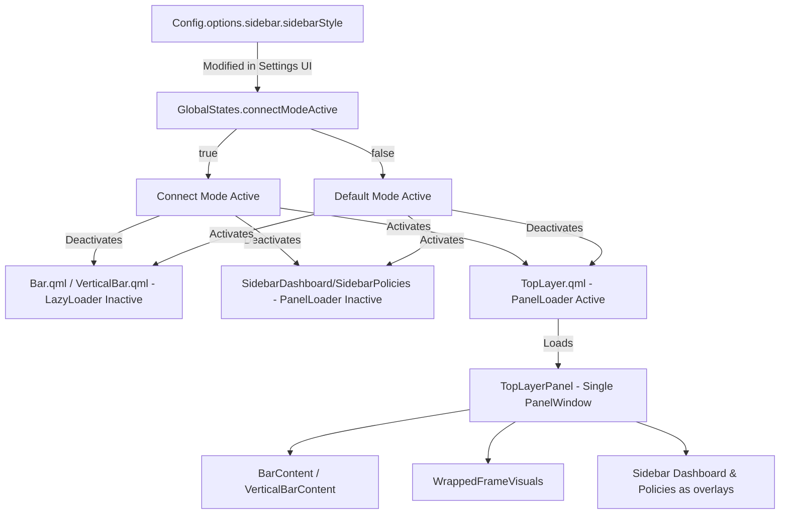

# Connect Mode - Integrated and Unified Sidebar System

This document details the technical inner workings, architecture, and modifications carried out to implement the **Connect Mode** system in Illogical Impulse (`ii`).

---

## 1. System Overview

**Connect Mode** is a unified interface architecture for Quickshell. Unlike the traditional mode (`default`), where each panel (Bar, Frame, Dashboard, Policies) is rendered in a separate `PanelWindow` (Wayland surface), Connect Mode consolidates all of these components into a **single transparent fullscreen surface** ([TopLayerPanel.qml](file:///home/pedro/.config/quickshell/ii/modules/ii/topLayer/TopLayerPanel.qml)).

### Main Visual and Technical Benefits:
1. **Pure Overlay and Zero Lag:** Sidebars open on top of active windows (`ExclusionMode.Ignore`) instead of forcing Hyprland windows to resize. This completely eliminates the performance bottleneck (lag) caused by recalculating the layout of open applications.
2. **Unified Blur and Transparency:** Since everything is drawn on the same Wayland surface, Hyprland renders the blur effect and opacity continuously, eliminating visual artifacts from overlapping windows.
3. **Fluid Animations:** The visual shrinking of the frame ([WrappedFrameVisuals.qml](file:///home/pedro/.config/quickshell/ii/modules/ii/wrappedFrame/WrappedFrameVisuals.qml)) and the movement of the sidebars occur via internal QML transitions synchronized.

---

## 2. Architecture and Activation Flow

The transition between the classic mode (`default`) and the integrated mode (`connect`) is reactively controlled by the `GlobalStates.connectModeActive` state.



### 2.1. Wayland Input Masking (Input Pass-Through)
Since [TopLayerPanel.qml](file:///home/pedro/.config/quickshell/ii/modules/ii/topLayer/TopLayerPanel.qml) is a fullscreen window, it would normally capture all mouse input, preventing the user from clicking on application windows behind it. 
To resolve this, the system leverages Quickshell's input masking via the `mask` property of `PanelWindow`. The mask is defined as a unified `Region` containing:
- The bar's mask region (active only where the bar is visible and hoverable).
- The frame's mask region (covering only the thin outline of the Wrapped Frame).
- The left and right sidebar rectangles (active only when the sidebars are open/animating).
- Small corner decorators connecting the sidebars to the bar.

Any click outside these specific regions passes directly through the transparent panel to the applications underneath.

---

## 3. Global Activation State (`connectModeActive`)

The system state is dynamically evaluated in [GlobalStates.qml](file:///home/pedro/.config/quickshell/ii/GlobalStates.qml):

```qml
readonly property bool connectModeActive: {
    if (!Config.ready) return false;
    const style = Config.options.sidebar.sidebarStyle || "default";
    if (style !== "connect") return false;
    
    // Connect style is disabled if the bar background style is Transparent
    if (Config.options.bar.barBackgroundStyle === 0) return false;
    
    // Works in all rounding modes except Edge (4)
    if (Config.options.appearance.fakeScreenRounding === 4) return false;
    
    // Only works with "Hug" (0) or "Rect" (2) corner styles
    const cs = Config.options.bar.cornerStyle;
    return cs === 0 || cs === 2;
}
```

### 3.1. Technical Rationale for Exclusions and Constraints
- **Transparent Bar Background (`barBackgroundStyle === 0`):** If the status bar background is completely transparent, there is no solid color background to connect the sidebar with. The transition would look visually broken and disjointed.
- **Floating Bar Style (`cornerStyle === 1`):** In `Float` style, the bar is detached from the screen edges with a margin of gaps. Since a connect-style sidebar must touch the screen boundaries (full-height sheet), combining it with a floating bar would break visual continuity.
- **Dynamic Island (`cornerStyle === 3`):** The Dynamic Island is a centered, morphing pill. It has no continuous edge borders, meaning there is no visual boundary to merge with the sidebar. Furthermore, its dynamic width calculation would conflict with the fullscreen layout constraints.
- **Edge Rounding Mode (`fakeScreenRounding === 4`):** Edge rounding applies rounding only to the inner corners of the bar while leaving outer corners square. This asymmetrical layout conflicts with the fullscreen sheet architecture of Connect Mode.

---

## 4. Details of Modified and New Files

### 4.1. Configuration and Global State

#### [Config.qml](file:///home/pedro/.config/quickshell/ii/modules/common/Config.qml) (Modified)
* **Modification:** Added the `sidebarStyle` property under the `sidebar` key of the persistent configuration file.
* **Code:** `property string sidebarStyle: "connect" // "default" | "connect"`

#### [GlobalStates.qml](file:///home/pedro/.config/quickshell/ii/GlobalStates.qml) (Modified)
* **Modification:** Implemented the reactive `connectModeActive` logic, in addition to managing the synchronization of the animated width of the left (`animatedLeftSidebarWidth`) and right (`animatedRightSidebarWidth`) sidebars to feed the visual mask.

#### [InterfaceConfig.qml](file:///home/pedro/.config/quickshell/ii/modules/settings/InterfaceConfig.qml) (Modified)
* **Modification:** Added the visual option under the "Sidebars" section to allow the user to toggle between "Default" and "Connect" styles.
* **Component:** `ConfigSelectionArray` mapping the options `"default"` and `"connect"`.

---

### 4.2. Panel Loading

#### [IllogicalImpulseFamily.qml](file:///home/pedro/.config/quickshell/ii/panelFamilies/IllogicalImpulseFamily.qml) (Modified)
* **Modification:** Configures dynamic loading according to the active mode.
* **Changes:**
  * Added `import qs` at the top of the file so that `GlobalStates` (singleton from the root namespace of the shell) is accessible in the `extraCondition` properties of the `PanelLoader`s. Without this import, the guards threw a `ReferenceError` during startup, failing silently.
  * `SidebarPolicies` and `SidebarDashboard` gained the condition `extraCondition: !GlobalStates.connectModeActive` (unloaded in Connect Mode).
  * `Bar` (horizontal) and `VerticalBar` gained `!GlobalStates.connectModeActive` in `extraCondition`, ensuring their Scopes are completely destroyed in Connect Mode (not just with the internal LazyLoader inactive). This prevents any race condition during the `barExtraCondition` cycle.
  * `TopLayer` was added with `extraCondition: GlobalStates.connectModeActive` (loaded only in Connect Mode).

#### [Bar.qml](file:///home/pedro/.config/quickshell/ii/modules/ii/bar/Bar.qml) and [VerticalBar.qml](file:///home/pedro/.config/quickshell/ii/modules/ii/verticalBar/VerticalBar.qml) (Modified)
* **Modification:** The main `LazyLoader` of the bar was updated to check if Connect Mode is inactive before loading native windows.
* **Code:** `active: GlobalStates.barOpen && !GlobalStates.screenLocked && !GlobalStates.connectModeActive`

#### [SidebarPolicies.qml](file:///home/pedro/.config/quickshell/ii/modules/ii/sidebarPolicies/SidebarPolicies.qml) (Modified)
* **Modification:** Disables the creation of the native `PanelWindow` if Connect Mode is enabled.
* **Code:** The main loader has `active: !GlobalStates.connectModeActive`.

#### [SidebarDashboard.qml](file:///home/pedro/.config/quickshell/ii/modules/ii/sidebarDashboard/SidebarDashboard.qml) (Modified)
* **Modification:** The native `PanelWindow` was wrapped in a `Loader` with `active: !GlobalStates.connectModeActive`. It previously used only `visible: ... && !connectModeActive` — this created the Wayland surface immediately upon loading the Scope, even if invisible, causing duplication on transitions. With the Loader, the surface is never created in Connect Mode.

---

### 4.3. New Unified Canvas (`TopLayer`)

#### [TopLayer.qml](file:///home/pedro/.config/quickshell/ii/modules/ii/topLayer/TopLayer.qml) (NEW)
* **Role:** Per-monitor instance manager. Maps the list of system screens (`Quickshell.screens`) and delegates a `TopLayerPanel` to each. Additionally, it manages the bar's *Space Reservers* invisibly.

#### [TopLayerPanel.qml](file:///home/pedro/.config/quickshell/ii/modules/ii/topLayer/TopLayerPanel.qml) (NEW)
* **Role:** The actual unified display window (fullscreen, transparent `PanelWindow` with `ExclusionMode.Ignore`).
* **Internal Content:**
  1. **Frame Visuals:** `Frame.WrappedFrameVisuals` reacting to the shrinking of sidebars.
  2. **Bar Visuals:** Loads `BarContent` (horizontal) or `VerticalBarContent` (vertical).
  3. **Sidebar Visuals:** Internal Rectangles rendering `SidebarPoliciesContent` and `SidebarDashboardContent` respectively.
  4. **Dynamic Wayland Mask:** A `mask` composed of `Region`s that defines which parts of the transparent fullscreen accept mouse clicks (bar, frame, and open sidebars), allowing direct clicks on background application windows in empty areas.

---

### 4.4. Component Visual Adjustments

#### [WrappedFrameVisuals.qml](file:///home/pedro/.config/quickshell/ii/modules/ii/wrappedFrame/WrappedFrameVisuals.qml) (Modified)
* **Modification:** Adapted to calculate the inner offset of the visual frames according to the active monitor and the animated opening of the sidebars under Connect Mode.

#### [SidebarDashboardContent.qml](file:///home/pedro/.config/quickshell/ii/modules/ii/sidebarDashboard/SidebarDashboardContent.qml) (Modified)
* **Modification:** Disables shadows (`StyledRectangularShadow`), borders, and corner radius (`radius`) when rendered in Connect Mode, making the panel fit perfectly into the edges of the monitor and the bar.

---

## 5. Space Reservation and Tiling Limitations

Since the unified `TopLayerPanel` has `exclusionMode` set to `ExclusionMode.Ignore`, it does not reserve physical screen space from the compositor. 

### 5.1. Phantom Space Reservers for the Bar
To prevent active windows from tiling over the status bar, [TopLayer.qml](file:///home/pedro/.config/quickshell/ii/modules/ii/topLayer/TopLayer.qml) instantiates transparent, invisible `PanelWindow`s (`hBarSpaceReserver` and `vBarSpaceReserver`) with `exclusionMode: ExclusionMode.Normal`.
- Their `exclusiveZone` is bound dynamically to the bar's `hiddenAmount`. When the bar auto-hides, the exclusive zone shrinks to `minZone` (which equals `wrappedFrameThickness` if Wrapped Frame is active, keeping windows aligned with the border, or `0` otherwise).

### 5.2. Overlay Nature of Sidebars
In Connect Mode, sidebars act strictly as overlays. They **do not** reserve any space from the compositor when opened.
- In default mode, pinning the left sidebar (`pin: true`) reserves space via the window's `exclusiveZone`. In Connect Mode, the pinning feature is **disabled** (the function returns immediately) because the single fullscreen surface cannot dynamically reserve partial screen edges without displacing the entire workspace.
- The **Detach** feature (`CTRL + D` / `sidebarLeftToggleDetach`) is also **disabled** under Connect Mode. Since the sidebars are drawn as internal QML rectangles inside the fullscreen window rather than native standalone Wayland surfaces, they cannot be detached into floating windows.

---

## 6. Corner Decoration and Screen Rounding

Connect Mode dynamically manages the visual rounding at the intersections between the bar and the sidebars depending on the active screen rounding style.

### 6.1. Case A: With Wrapped Frame (`fakeScreenRounding === 3`)
When the Wrapped Frame is active, it draws a continuous outline around the usable desktop space.
- The corner loaders in [TopLayerPanel.qml](file:///home/pedro/.config/quickshell/ii/modules/ii/topLayer/TopLayerPanel.qml) (`leftSidebarTopCornerLoader`, etc.) are **disabled** (`active: ... && fakeScreenRounding != 3`).
- Instead, [WrappedFrameVisuals.qml](file:///home/pedro/.config/quickshell/ii/modules/ii/wrappedFrame/WrappedFrameVisuals.qml) handles the visual corner transitions using its own `RoundCorner` components (`bottomLeftCorner`, etc.), which shift dynamically along with the sidebar offset. This prevents overlapping transparencies and double-blur artifacts.

### 6.2. Case B: Without Wrapped Frame (`fakeScreenRounding !== 3`)
If the user uses corner styles like `0` (None), `1` (Always), or `2` (When not fullscreen) while Connect Mode is active:
- The corner loaders in [TopLayerPanel.qml](file:///home/pedro/.config/quickshell/ii/modules/ii/topLayer/TopLayerPanel.qml) are **activated**.
- These loaders draw `RoundCorner` widgets with the active theme background color at the exact intersection where the bar and the sidebar meet. This rounds out the intersection and avoids a sharp 90-degree blocky meeting point, maintaining visual consistency with the Material You design system.

---
